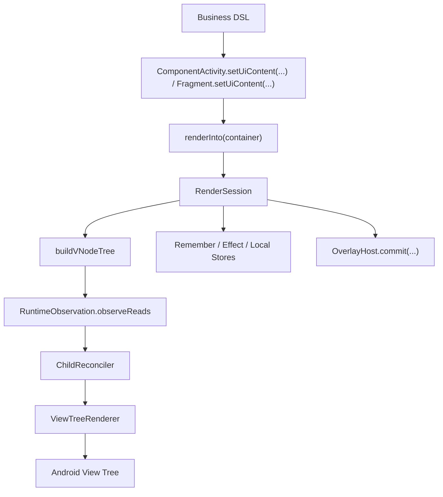

# ViewCompose Architecture

## 1. 文档定位

本文档是 `ViewCompose` 的**当前架构规范版**，用于定义：

1. 模块职责边界
2. 核心调用链
3. 新增代码的落点规则
4. 变更时必须遵守的约束

如果实现要偏离本文档，必须先更新文档，再改代码。

历史长版快照见：

- [ARCHITECTURE_FULL_2026-03-06.md](/Users/gzq/AndroidStudioProjects/UIFramework/docs/archive/ARCHITECTURE_FULL_2026-03-06.md)

## 2. 当前基线（2026-03）

- 技术基线：Kotlin + Android View System
- SDK：`minSdk 24`、`compileSdk 36`
- 当前模块：`:viewcompose-runtime`、`:viewcompose-renderer`、`:viewcompose-widget-core`、`:viewcompose-overlay-android`、`:viewcompose-image-coil`、`:viewcompose-benchmark`、`:app`

### 2.1 模块职责

| 模块 | 职责 | 约束 |
| --- | --- | --- |
| `viewcompose-runtime` | 状态与读依赖观察（`state/observation`） | 不承载 Android 视图实现 |
| `viewcompose-renderer` | `VNode/NodeSpec`、reconcile、View 挂载与 patch | 不承载业务 DSL |
| `viewcompose-widget-core` | DSL、session、context/theme/defaults、overlay 声明契约 | 不放 Android 平台弹层实现 |
| `viewcompose-overlay-android` | Android overlay host/presenter（Dialog/Popup/ModalBottomSheet/Snackbar/Toast） | 只做平台实现 |
| `viewcompose-image-coil` | 远程图片加载桥接 | 不回流核心渲染逻辑 |
| `viewcompose-benchmark` | 宏基准入口与性能回归数据采集 | 不承载业务 demo 与框架语义逻辑 |
| `app` | demo、manual verification、ui tests 入口 | 不承载框架核心实现 |

### 2.2 当前架构判断

当前架构是可维护的 View-based 声明式 v1：

1. 主树更新模型：根级 render + keyed 复用
2. 列表/分页等复用容器：独立 session 刷新路径
3. overlay：声明契约与平台实现已分层
4. typed props：第一方高频节点已收敛到 `NodeSpec`

### 2.3 `app` 目录落位基线

`app` 模块采用“入口与演示分层”：

1. `app/src/main/java/com/viewcompose/activity/entry`
   - 根入口 Activity（如 `MainActivity`、渲染宿主入口）
2. `app/src/main/java/com/viewcompose/activity/demo/pages/<domain>`
   - demo 页面 Activity 路由入口，按页面域分层（`core/interaction/advanced/quality`）
3. `app/src/main/java/com/viewcompose/activity/demo/sandbox`
   - 非核心页面实验入口（动画/手势/图形等）
4. `app/src/main/java/com/viewcompose/demo/core`
   - demo 全局骨架与共享能力（catalog、theme session、test tags、section helpers）
5. `app/src/main/java/com/viewcompose/demo/pages/<feature>`
   - 按功能页归档的 demo 实现（foundations/layouts/input/feedback/...）
6. `app/src/androidTest/java/com/viewcompose`
   - demo/UI 回归测试

### 2.4 `viewcompose-renderer` 目录落位基线

renderer 侧避免“单目录平铺”，按职责拆到二级目录：

1. `viewcompose-renderer/src/main/java/.../view/container/{core,layout,collection,navigation,input}`
   - Android View 容器映射层，按控件族群分类
2. `viewcompose-renderer/src/main/java/.../view/tree/binder/core`
   - 绑定流程核心（factory/differ/plan/registry/modifier）
3. `viewcompose-renderer/src/main/java/.../view/tree/binder/widget`
   - 分控件 binder 实现（content/input/media/feedback/collection 等）
4. `viewcompose-renderer/src/main/java/.../view/lazy/{adapter,focus,layout,reuse,session,state}`
   - 延迟容器子系统按能力拆分（适配器、焦点跟随、间距布局、复用策略、session、状态）

## 3. 核心调用链

## 4. 强约束边界

### 4.1 平台实现边界

1. Android `Dialog/PopupWindow/Toast/Snackbar` 宿主实现只放 `viewcompose-overlay-android`。
2. `viewcompose-widget-core` 只保留平台无关声明契约与 runtime 组合能力。
3. demo 专用逻辑不回流到框架模块。

### 4.2 `Modifier / Props / Theme` 边界

1. `Modifier`：通用修饰与 scoped parent-data。
2. 组件语义参数：走组件 DSL 参数 + `NodeSpec`。
3. 主题默认值：走 `Theme -> Defaults`，不把主题直接做成通用 modifier。

对应规范：

- [MODIFIER.md](/Users/gzq/AndroidStudioProjects/UIFramework/MODIFIER.md)
- [NODE_PROPS.md](/Users/gzq/AndroidStudioProjects/UIFramework/NODE_PROPS.md)
- [THEMING.md](/Users/gzq/AndroidStudioProjects/UIFramework/THEMING.md)

### 4.3 宿主接入边界

1. `ComponentActivity.setUiContent(...)` 不暴露 `RenderSession` 给页面调用方，并由宿主自动管理 `dispose`。
2. `Fragment.setUiContent(...)` 是官方入口：不暴露 `RenderSession`，并在 `viewLifecycleOwner` 销毁时自动 `dispose`。
3. `setUiContent` 的默认 `overlayHostFactory` 优先尝试 `AndroidOverlayHost`（classpath 可用时）；不可用时回退 no-op 并输出提示，可由调用方显式覆盖。
4. 上述默认行为依赖反射契约类名 `com.viewcompose.overlay.android.host.AndroidOverlayHost`；若 overlay 包路径调整，必须同步更新反射常量与契约测试。
5. system bars insets 走组件侧 `Modifier.systemBarsInsetsPadding(...)`，不绑死 Activity 全局参数。

### 4.4 延迟 session 容器边界

只要容器满足“延迟创建 + holder/session 复用”，就必须视为一级架构对象，必须具备：

1. 结构稳定时的可见内容刷新路径
2. 空 diff 刷新保障
3. recycle/dispose 与生命周期一致性
4. framework 托管的 `RecyclerView/ViewPager2` 容器默认保持“本地池 + 系统动画器”；可通过 `Modifier.lazyContainerReuse(...)` 对单个容器启用共享池和关闭 `itemAnimator`

专项清单：

- [SESSION_CONTAINER_CHECKLIST.md](/Users/gzq/AndroidStudioProjects/UIFramework/SESSION_CONTAINER_CHECKLIST.md)

### 4.5 Environment 边界

1. 宿主入口（`ComponentActivity.setUiContent(...)`、`Fragment.setUiContent(...)`）默认自动注入 `UiEnvironment(androidContext = root.context)`。
2. 业务层允许在局部子树使用 `UiEnvironment(values = ...)` 做覆盖；默认注入不阻断局部覆写。
3. `viewcompose-renderer` 不依赖 `viewcompose-widget-core/context/Environment`，只消费 renderer 已解析的 `NodeSpec` 与平台参数。
4. `viewcompose-renderer` 中的 dp/sp 尺寸换算统一走内部工具（`viewcompose-renderer/view/DimensionUtils.kt`），容器类禁止私有 `density/dpToPx` 重复实现。
5. Android 平台环境提取入口固定为 `AndroidEnvironmentBridge`，新增 Android 环境字段时必须先扩展该桥接，再进入 `UiEnvironmentValues`。

## 5. 当前热点与风险

1. `ViewTreeRenderer` 仍是复杂度热点，新增能力优先拆辅助对象，不继续堆主类。
2. 普通页面仍偏根级重跑，后续优化应聚焦“可跳过更新”与诊断能力。
3. `viewcompose-widget-core` 仍承担较多职责，演进时优先收边界，不盲目拆模块。
4. 延迟 session 容器的测试覆盖仍不均衡，`LazyVerticalGrid` 与 `VerticalPager` 缺少专项回归。
5. `viewcompose-widget-core` 中仍包含 `AndroidHostBridge/AndroidThemeBridge/AndroidEnvironmentBridge`，若后续目标扩展到跨平台，需要规划独立 host bridge 模块，避免 core 继续增重。

## 6. 变更落地清单（必须执行）

任何架构相关改动，至少完成：

1. 模块/目录归属审查
2. 文档同步（本文档 + 相关规范文档）
3. 单元测试或 instrumentation 回归（按能力类型选择）
4. demo 验证路径补齐

执行流程规则见：

- [WORKFLOW.md](/Users/gzq/AndroidStudioProjects/UIFramework/WORKFLOW.md)

## 7. 关联文档

1. 统一能力路线图：[ROADMAP.md](/Users/gzq/AndroidStudioProjects/UIFramework/ROADMAP.md)
2. 性能主线：[PERFORMANCE.md](/Users/gzq/AndroidStudioProjects/UIFramework/PERFORMANCE.md)
3. 文档入口：[CONTEXT.md](/Users/gzq/AndroidStudioProjects/UIFramework/CONTEXT.md)
