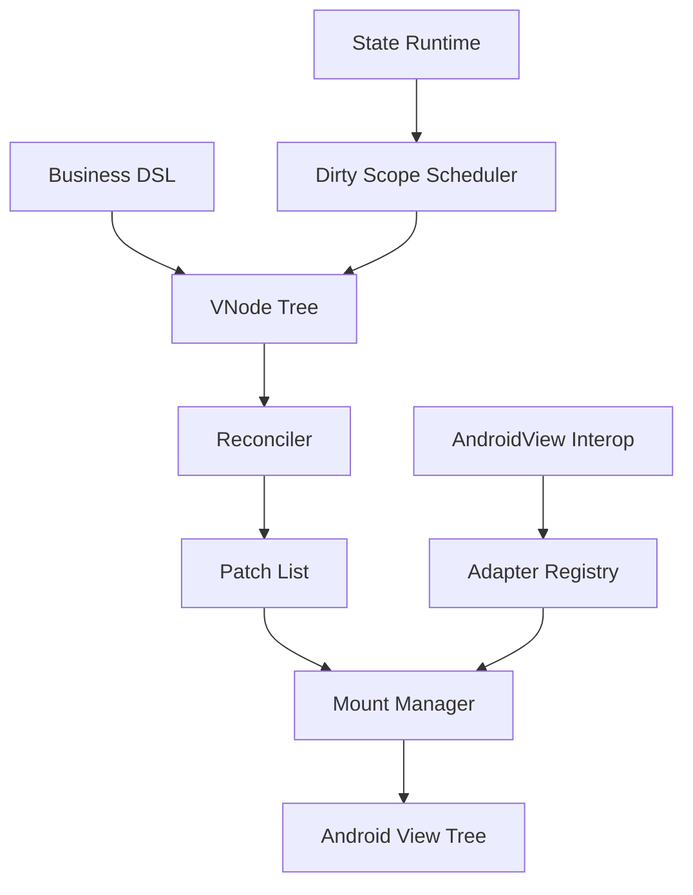
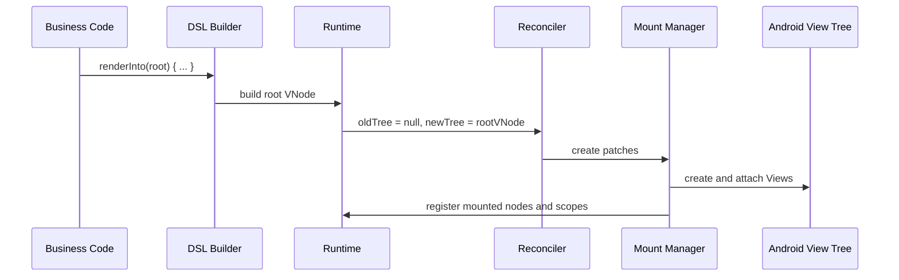
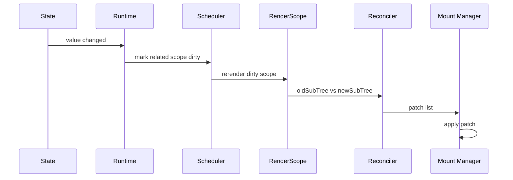

# UIFramework Architecture

## 1. 文档定位

本文档定义 `UIFramework` 的目标、边界、模块职责、运行时模型、数据流、更新时序和阶段性开发计划。

这份文档是后续开发的主基线。后续实现默认遵循本文档；如果实现过程中需要偏离，必须先更新本文档中的对应章节，再继续开发。

项目当前状态：

- 日期：2026-02-28
- 仓库：`/Users/gzq/AndroidStudioProjects/UIFramework`
- 当前工程状态：标准空白 Android App，只有 `:app` 模块
- 技术基线：Kotlin + Android View System，`minSdk 24`，`compileSdk 36`

## 2. 产品定义

`UIFramework` 的目标不是复刻 Jetpack Compose 编译器与 Runtime，而是：

> 做一个基于 Android View 的声明式渲染引擎，具备虚拟树、keyed diff、状态驱动局部更新、原生 View 互操作。

这个定义包含四个核心承诺：

1. UI 以声明方式描述，而不是手动查找和操作 `View`
2. 框架内部维护虚拟节点树，使用 diff 进行增量更新
3. 状态变化驱动局部子树刷新，而不是依赖页面级 `notifyDataSetChanged`
4. 可以无缝复用现有 `View`、`ViewGroup`、自定义控件与业务组件

## 3. 设计目标

### 3.1 核心目标

- 提供 Kotlin-first、易书写的声明式 API
- 使用虚拟节点树表达 UI 结构
- 使用 `key + type` 进行稳定 identity 判定
- 将节点变化最小化映射到真实 `View` 树
- 建立轻量状态系统，驱动局部更新
- 支持原生 `View` 互操作，便于渐进接入
- 为列表场景提供高价值的增量更新能力
- 提供必要的 debug 能力，便于定位重建与 patch 行为

### 3.2 非目标

- v1 不追求 Compose 级别的编译器优化
- v1 不实现完整的多平台能力
- v1 不自研跨平台布局引擎
- v1 不追求任意线程执行 UI patch
- v1 不优先做动画 DSL、大规模手势系统和复杂导航系统

## 4. 设计原则

- 声明优先：业务代码描述结果，不描述操作步骤
- View 兼容优先：优先兼容 Android View 生态，而不是绕开它
- 局部更新优先：任何状态变化都尽量收敛到局部子树
- 显式 identity：涉及复用、移动、列表项时必须可表达稳定 key
- 运行时简单可控：v1 先实现清晰、可调试的 Runtime，再考虑极致优化
- 渐进增强：先跑通基础节点、状态、diff、互操作，再扩展布局与性能

## 5. 总体架构



整体架构分为 7 个角色：

| 角色 | 职责 |
| --- | --- |
| DSL Layer | 提供 `Column {}`、`Text()`、`Modifier` 等声明式 API |
| Composition Layer | 将 DSL 构造成虚拟节点树 `VNode` |
| State Runtime | 管理 `State`、依赖收集、dirty scope 标记、调度更新 |
| Reconciler | 比较旧树和新树，生成 patch |
| Mount Manager | 将 patch 应用到真实 `View` 树 |
| Adapter Registry | 管理虚拟控件到真实 `View` 的映射与更新策略 |
| Interop Layer | 支持挂载现有原生 `View` / 自定义 `View` |

## 6. 推荐模块划分

文档定义的目标模块如下。当前仓库只有 `:app`，后续按里程碑逐步拆分。

| 模块 | 职责 |
| --- | --- |
| `:ui-runtime` | 状态系统、依赖追踪、dirty scope、调度器、effect 生命周期 |
| `:ui-node` | `VNode`、`Key`、`Props`、`Modifier`、Patch 模型 |
| `:ui-renderer` | Reconciler、MountManager、NodeCoordinator、更新入口 |
| `:ui-view-adapter` | Android `View` 适配器注册与默认实现 |
| `:ui-widget-core` | `Text`、`Button`、`Box`、`Row`、`Column` 等基础组件 |
| `:ui-widget-lazy` | `LazyColumn`、列表 item identity、复用与局部刷新 |
| `:ui-debug` | 树打印、patch 日志、重组统计、调试开关 |
| `:sample-app` | 演示与验证入口，后期替代当前 `:app` 或并入 `:app` |

v1 可以先合并实现为较少模块，以减少初期工程复杂度。推荐初期拆分如下：

- `:ui-runtime`
- `:ui-renderer`
- `:ui-widget-core`
- `:app`

其中 `VNode` 与 Adapter 可以先放在 `:ui-renderer`，等结构稳定后再拆。

## 7. 核心数据模型

### 7.1 VNode

`VNode` 是 UI 的不可变描述，不直接等于 Android `View`。

建议核心字段：

```kotlin
data class VNode(
    val type: NodeType,
    val key: Any? = null,
    val props: Props = Props.Empty,
    val modifier: Modifier = Modifier,
    val children: List<VNode> = emptyList()
)
```

字段说明：

| 字段 | 说明 |
| --- | --- |
| `type` | 虚拟控件类型，例如 `Text`、`Column`、`AndroidView` |
| `key` | 稳定 identity，主要用于列表项、可移动节点、复用判断 |
| `props` | 组件参数，例如文本、颜色、点击事件、方向等 |
| `modifier` | 通用修饰链，例如大小、边距、点击、背景、可见性 |
| `children` | 子节点列表 |

### 7.2 NodeType

建议 `NodeType` 设计成稳定标识，不直接用字符串。

```kotlin
sealed interface NodeType {
    data object Text : NodeType
    data object Button : NodeType
    data object Row : NodeType
    data object Column : NodeType
    data object Box : NodeType
    data object AndroidView : NodeType
}
```

### 7.3 Props

`Props` 是节点私有参数集合，不承载通用布局和行为参数。

建议：

- 节点私有参数进入 `props`
- 通用行为尽量进入 `modifier`
- `props` 应当是稳定、可比较的不可变结构

### 7.4 Modifier

`Modifier` 是横切属性链，负责承载可组合的通用能力。

v1 支持范围：

- `size`
- `padding`
- `margin`
- `background`
- `alpha`
- `visibility`
- `clickable`
- `enabled`
- `tag`

设计目标：

- 同一能力的更新逻辑集中在 modifier adapter
- 避免每个节点 API 重复声明一大批通用属性
- 让布局与交互表达方式统一

### 7.5 Key

`key` 是运行时 identity 的基础规则。

设计结论：

- 节点匹配优先使用 `type + key`
- 没有 `key` 时，退化为同层级位置匹配
- 可重排集合必须要求稳定 key
- `LazyColumn` item 需要显式 `key` 能力

## 8. 组件与书写模型

### 8.1 目标 API 风格

```kotlin
renderInto(root) {
    Column(
        modifier = Modifier
            .padding(16.dp)
            .background(Color.White)
    ) {
        Text(text = titleState.value)
        Button(
            text = "Refresh",
            onClick = { reload() }
        )
        LazyColumn {
            items(
                items = messages,
                key = { it.id }
            ) { message ->
                Text(message.title)
            }
        }
    }
}
```

设计要求：

- API 看起来像声明结果，不像写 imperative 代码
- 容器使用 lambda 组织子节点
- `Modifier` 链式组合
- 业务方尽量不接触底层 `View`

### 8.2 书写层与运行层分离

必须明确：

- DSL 是输入层
- `VNode` 是中间层
- `View` 是输出层

业务代码不能直接依赖 “节点声明一定对应某个固定 View 实现”，否则后续 adapter 优化会被锁死。

## 9. 状态系统设计

### 9.1 设计定位

状态系统不是 `LiveData` 替代品，而是声明式渲染 Runtime 的更新触发器。

目标：

- 表达可观察状态
- 支持读取依赖自动收集
- 状态变更时只刷新相关 scope
- 合并短时间内的多次状态变更

### 9.2 核心接口

```kotlin
interface State<T> {
    val value: T
}

interface MutableState<T> : State<T> {
    override var value: T
}

fun <T> mutableStateOf(value: T): MutableState<T>
fun <T> derivedStateOf(block: () -> T): State<T>
```

### 9.3 RenderScope

为了实现局部更新，需要引入 `RenderScope`。

职责：

- 表示一次可独立重建的渲染作用域
- 记录该作用域在渲染时读取了哪些 `State`
- 在相关 `State` 变化时被标记为 dirty
- 由调度器在下一批处理中触发重建

建议原则：

- 页面根有 root scope
- 容器节点可引入子 scope
- 列表 item 可拥有更细粒度 scope

v1 不追求任意节点自动最细粒度切分，先采用“容器级子树 scope”。

### 9.4 依赖追踪

运行时过程：

1. 当前 `RenderScope` 开始执行 render block
2. render 过程中读取 `state.value`
3. runtime 记录 “scope -> state” 和 “state -> scope” 双向关系
4. `state.value` 变化时，相关 scope 被标记 dirty
5. scheduler 将 dirty scope 合并到下一次 UI 提交

### 9.5 调度策略

v1 采用简单稳定的主线程批量提交策略：

- 状态可在任意线程修改，但内部最终通过主线程调度 UI 更新
- 一个 frame 内多次状态变更合并为一次提交
- 同一个 scope 重复 dirty 只提交一次
- patch 应用始终发生在主线程

## 10. Reconciler 设计

### 10.1 目标

Reconciler 负责比较旧 `VNode` 树与新 `VNode` 树，并生成最小必要 patch。

输出 patch 类型建议包括：

- `Insert`
- `Remove`
- `Move`
- `Replace`
- `UpdateProps`
- `UpdateModifier`

### 10.2 节点匹配规则

默认匹配规则：

1. 优先比较 `type`
2. 如果存在 `key`，必须比较 `key`
3. `type` 不同直接 `Replace`
4. `type` 相同且 `key` 相同则继续比较 `props / modifier / children`
5. 无 `key` 的兄弟节点按顺序匹配

### 10.3 子节点 diff

v1 采用 keyed children diff：

- 如果子节点存在显式 key，优先使用 key 建立映射
- 同 key 节点支持 `Move`
- 新树新增节点生成 `Insert`
- 旧树缺失节点生成 `Remove`
- 同一节点只更新变化的 `props` 和 `modifier`

### 10.4 patch 生成原则

- 优先局部更新，不轻易整棵 replace
- 不为了理论最优算法牺牲实现清晰度
- patch 必须可打印、可调试
- patch 应独立于 `View` 实现，便于测试

## 11. View 挂载与适配层

### 11.1 Adapter Registry

每一种虚拟节点类型对应一套 adapter。

建议接口：

```kotlin
interface ViewAdapter<V : View> {
    fun create(context: Context): V
    fun bind(view: V, props: Props)
    fun applyModifier(view: V, modifier: Modifier)
    fun mountChildren(view: V, children: List<MountedNode>)
    fun unmount(view: V)
}
```

### 11.2 Mount Manager

职责：

- 持有 `VNode` 与真实 `View` 的挂载关系
- 应用 patch 到真实树
- 管理 child attach/detach
- 处理节点销毁与资源释放

### 11.3 默认控件映射

v1 映射建议：

| VNode | Android View |
| --- | --- |
| `Text` | `TextView` |
| `Button` | `TextView` 或 `MaterialButton` |
| `Box` | `FrameLayout` |
| `Row` | 横向 `LinearLayout` |
| `Column` | 纵向 `LinearLayout` |
| `Image` | `ImageView` |
| `AndroidView` | 直接托管业务侧提供的 `View` |

### 11.4 扁平化策略

v1 不主动实现激进的 view flattening，只预留架构空间。

理由：

- 初期优先保证声明与更新模型稳定
- flattening 会显著提高布局、事件、modifier 实现复杂度
- 等基本能力稳定后，再评估对 `Box/Row/Column` 做局部优化

## 12. 原生 View 互操作

互操作是本框架的关键竞争力之一。

建议提供：

```kotlin
AndroidView(
    key = "legacy_chart",
    factory = { context -> LegacyChartView(context) },
    update = { view -> view.bind(data) }
)
```

设计要求：

- 支持挂载已有自定义 `View`
- 支持更新 block
- 支持 `key`
- 支持生命周期回调
- 明确 factory 只在首次创建或 identity 变化时触发

## 13. 生命周期与 Effect

### 13.1 必要性

声明式树只解决 UI 描述，不自动解决副作用管理。

必须区分：

- render 阶段：只构建声明，不做副作用
- commit 阶段：patch 应用完成后，才允许副作用进入 attach 态

### 13.2 v1 Effect 能力

建议 v1 提供：

- `OnMount`
- `OnUnmount`
- `DisposableEffect(key)`

这些能力用于：

- 注册和释放监听器
- 启停动画
- 托管生命周期敏感资源

### 13.3 生命周期绑定

框架需感知：

- `View` attach/detach
- `LifecycleOwner`
- 页面销毁时的 scope 释放

所有 state 订阅、effect、interop 资源都必须可追踪释放，避免泄漏。

## 14. 列表与懒加载设计

`LazyColumn` 是 v1 必做能力，不是增强项。

原因：

- 列表是 Android 业务最常见场景
- 没有列表能力，框架只能验证 demo，无法进入真实业务
- 列表正好检验 `key`、局部更新、复用、状态边界设计是否成立

v1 建议方案：

- 基于 `RecyclerView` 承载
- item 内容仍由框架的 `VNode` 和 adapter 渲染
- item identity 使用显式 `key`
- item scope 独立 dirty
- item 内部保留状态恢复入口

这样可以复用成熟滚动与回收能力，避免一开始自研复杂容器。

## 15. 调试与可观测性

没有调试能力，声明式运行时很难落地。

v1 至少提供：

- 打印当前 `VNode` 树
- 打印 patch 列表
- 统计每个 scope 的重建次数
- 标记哪些 `State` 触发了某次更新
- 通过 debug 开关决定是否输出日志

后续增强可包括：

- 可视化树检查器
- 渲染耗时统计
- measure/layout 次数统计

## 16. 数据流

### 16.1 首次渲染数据流



### 16.2 状态更新数据流



## 17. 更新时序

### 17.1 首次渲染时序

1. 业务代码调用 `renderInto(root) { ... }`
2. DSL 构造根 `VNode`
3. Runtime 创建 root scope
4. 执行 render block，记录 state 读取依赖
5. Reconciler 对比空树与新树
6. Mount Manager 根据 patch 创建并挂载真实 `View`
7. commit 完成后触发 `OnMount` / effect attach

### 17.2 状态变更时序

1. 某个 `MutableState` 的 `value` 被更新
2. Runtime 查询依赖该 state 的 scopes
3. 相关 scopes 被标记 dirty
4. Scheduler 在下一次合适时机合并执行更新
5. dirty scope 重新执行 render block，生成新的子树
6. Reconciler 比较旧子树与新子树
7. Mount Manager 应用 patch 到真实 `View`
8. 完成后触发必要的 effect 更新与资源释放

### 17.3 节点 replace 时序

1. 新旧节点 `type` 不同，或 identity 不匹配
2. Reconciler 生成 `Replace`
3. Mount Manager 先执行旧节点的 dispose / unmount
4. 创建新节点的真实 `View`
5. 挂载到父容器对应位置
6. 触发新节点 attach 回调

## 18. 性能策略

v1 采用“先稳定、后极致”的策略。

### 18.1 必做优化

- key 驱动的局部 children diff
- scope 级 dirty 合并
- 主线程批量提交
- `props` / `modifier` 差异化 patch
- 列表场景优先复用 `RecyclerView`

### 18.2 暂缓优化

- view flattening
- 后台 layout 计算
- 复杂的 slot table 或编译期跳过重组
- 高级动画合成

## 19. API 设计约束

后续 API 设计必须满足以下约束：

- 容器节点支持 lambda child builder
- 通用属性优先走 `Modifier`
- 所有可重排集合都支持显式 `key`
- 事件参数命名统一，例如 `onClick`
- 互操作入口命名稳定为 `AndroidView`
- 状态入口命名靠近 Compose 心智，例如 `mutableStateOf`

## 20. 测试策略

需要从一开始建立 3 类测试：

| 类型 | 内容 |
| --- | --- |
| 单元测试 | `State`、依赖追踪、diff、patch 生成 |
| 集成测试 | patch 应用到 `View` 树后的结构与属性正确性 |
| Sample 验证 | 示例页面验证首次渲染、局部更新、列表更新和互操作 |

关键测试点：

- 同 key 移动不重建 View
- prop 更新不 replace 整个节点
- state 更新只触发相关 scope
- `AndroidView` factory 不被重复错误调用
- 列表项重排后状态与 view 绑定不串位

## 21. 风险与对策

| 风险 | 说明 | 对策 |
| --- | --- | --- |
| API 看起来像 Compose，行为却不一致 | 用户会产生错误预期 | 文档明确目标是“Compose-like on View”，不是 Compose clone |
| 状态系统过早复杂化 | Runtime 难以调试 | v1 保持 scope 粒度有限、更新链路清晰 |
| 过早追求 flattening | modifier 与事件处理复杂度暴涨 | 先稳定 adapter 和 diff |
| 列表状态错乱 | key/复用策略不成熟 | `LazyColumn` 强制 key，优先基于 RecyclerView |
| 互操作生命周期不清晰 | 容易泄漏资源 | 明确 attach/detach 与 dispose 规则 |

## 22. 分阶段开发计划

### 22.1 Phase 0: 工程重构

目标：

- 从空白 App 调整为可承载框架开发的模块结构
- 建立基础测试环境

交付：

- 新增 `:ui-runtime`
- 新增 `:ui-renderer`
- 新增 `:ui-widget-core`
- `:app` 作为 sample 入口

### 22.2 Phase 1: 跑通最小渲染闭环

目标：

- 从 DSL 到 `View` 挂载跑通完整链路

交付：

- `VNode`
- root render API
- `Text`、`Column`、`Box`
- Adapter Registry
- 首次渲染能力

### 22.3 Phase 2: 跑通状态驱动更新

目标：

- 建立局部刷新能力

交付：

- `mutableStateOf`
- RenderScope
- dirty scheduler
- prop diff 与 patch 应用

### 22.4 Phase 3: 补齐基础交互与 Modifier

目标：

- 让 API 具备实际页面搭建能力

交付：

- `Modifier`
- 点击事件
- 常见布局属性
- 背景、可见性、尺寸类更新

### 22.5 Phase 4: 列表能力

目标：

- 进入真实业务场景

交付：

- `LazyColumn`
- item key
- item scope
- 列表更新验证

### 22.6 Phase 5: 互操作与调试

目标：

- 提升业务接入能力与可维护性

交付：

- `AndroidView`
- 树打印
- patch 日志
- scope 更新统计

## 23. v1 范围定义

v1 必须包含：

- `renderInto`
- `Text`
- `Button`
- `Box`
- `Row`
- `Column`
- `AndroidView`
- `LazyColumn`
- `Modifier`
- `mutableStateOf`
- `derivedStateOf`
- keyed diff
- 局部 scope 更新
- 基础 debug 日志

v1 不承诺：

- 完整 Compose 兼容 API
- 编译器插件
- 精细到表达式级的重组优化
- 复杂动画系统
- 自研滚动与回收容器

## 24. 协作约定

后续开发与讨论遵循以下约定：

- 所有新增能力优先判断是否符合本文档目标与边界
- 如需引入新模块、调整分层或修改更新模型，先更新本文档
- 所有阶段性实现优先保证可运行、可验证、可调试
- 任何性能优化都不应破坏 identity、state、patch 的正确性

## 25. 下一步实施建议

按当前项目状态，建议的直接下一步是：

1. 调整 Gradle 工程结构，拆出 `:ui-runtime`、`:ui-renderer`、`:ui-widget-core`
2. 实现 `VNode`、`NodeType`、`renderInto`
3. 实现 `Text`、`Column`、`Box` 的首次渲染
4. 再接入 `mutableStateOf` 和局部更新

这条路线风险最低，也最容易持续验证设计是否成立。
