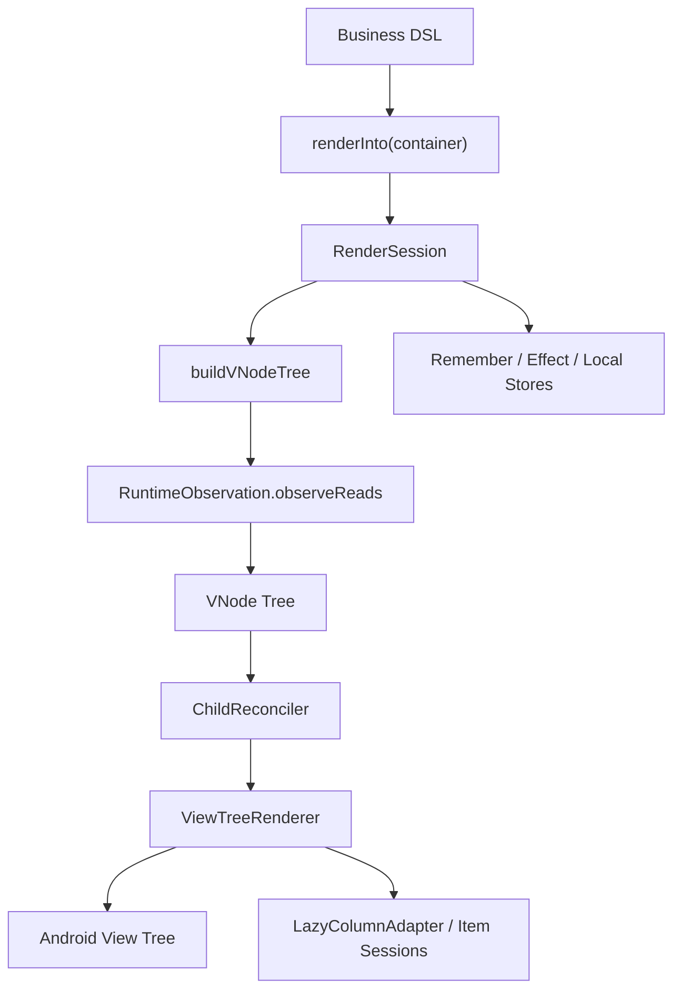

# UIFramework Architecture

## 1. 文档定位

本文档定义 `UIFramework` 当前阶段的真实架构基线，用来回答 4 个问题：

1. 现在框架实际上是怎么工作的
2. `ui-runtime`、`ui-renderer`、`ui-widget-core` 的职责是否清晰
3. 当前架构和 Compose 相比，稳定性、健壮性、可扩展性还缺什么
4. 后续开发应该沿什么方向继续收敛，而不是再回到早期理想化蓝图

如果实现要偏离本文档，必须先更新本文档，再继续开发。

当前状态：

- 日期：2026-03-01
- 仓库：`/Users/gzq/AndroidStudioProjects/UIFramework`
- 当前模块：`:ui-runtime`、`:ui-renderer`、`:ui-widget-core`、`:ui-overlay-android`、`:ui-image-coil`、`:app`
- 技术基线：Kotlin + Android View System，`minSdk 24`，`compileSdk 36`

## 2. 当前总判断

当前框架的方向是成立的，但必须把评价说准确：

> `UIFramework` 现在是一个基于 Android View 的声明式渲染框架 v1，采用根级 `RenderSession` 驱动重建、虚拟树 keyed 复用、集中式 renderer、列表 item session、以及基于 local 的主题/环境上下文。

这条路对当前阶段是合理的，因为：

- 已经能稳定支撑“声明式 API + View 互操作 + keyed 更新 + demo/manual test”
- 复杂度仍然可控
- 和 Android View 主线程模型是兼容的
- `typed props` 已经完成向 `NodeProps` 的过渡基础设施建设

但它还不是最终形态。和 Compose 相比，当前架构仍然有 5 个明显短板：

1. 更新粒度仍然偏粗，通用页面节点仍以“根级重跑 + keyed 复用”为主
2. renderer 仍然过于集中，`ViewTreeRenderer` 是明显的大类
3. 组合运行时还主要住在 `ui-widget-core`，`ui-runtime` 仍然过薄
4. `VNode + Props` 仍然偏动态，类型约束和错误发现能力弱于 Compose
5. `Props` 仍然存在于主链路里，尚未完全收缩为兼容/扩展层

所以正确结论不是“架构已经成熟”，而是：

> 当前架构是合理的 v1 骨架，但后续必须继续收敛职责、减少隐式约定、增强类型和边界，而不是继续无限堆功能。

## 3. 产品定义

当前产品定义保持不变：

> 做一个基于 Android View 的声明式渲染引擎，具备虚拟树、keyed diff、状态驱动更新、原生 View 互操作。

但这里的“状态驱动更新”必须按当前真实能力表述：

- 普通页面节点：根级 render block 重跑 + renderer keyed reuse
- `LazyColumn` item：具备独立 item session 和本地状态边界
- 主题 / 环境 / remember / effect：基于 local + session store 参与一次 render session

它不是 Compose 那种“任意子树细粒度重组”，而是：

> 根级重建 + 最小复用 + 列表项独立 session。

## 4. 当前真实模块职责

### 4.1 模块级职责

| 模块 | 当前职责 | 当前评价 |
| --- | --- | --- |
| `:ui-runtime` | 可观察状态、派生状态、读依赖观察 | 结构清晰，但范围偏窄 |
| `:ui-renderer` | `VNode`、`Modifier`、patch/reconcile、Android View 挂载、自定义容器、lazy adapter | 当前技术核心，结构比过去清晰 |
| `:ui-widget-core` | DSL、session、remember/effect、local/theme/environment、overlay 声明契约、widget 默认值 | 当前最混，但已整理目录 |
| `:ui-overlay-android` | Android 宿主级 overlay presenter、Dialog/PopupWindow 等平台弹层接线 | 新增模块，用于承接不适合继续堆在 `ui-widget-core` 的平台实现 |
| `:ui-image-coil` | 可选远程图片加载桥接 | 角色清晰，边界合理 |
| `:app` | demo、人工测试、主题切换、回归入口 | 合理 |

当前 overlay 相关补充判断：

- `Snackbar` / `Toast` 继续走宿主 feedback request 模型
- `Dialog` / `PopupWindow` 已经切到独立 `OverlaySurfaceSession`，不再由 Android presenter 直接 patch `VNode` 列表
- 这让 overlay 子树拥有明确的 session、remember/effect/local 边界，和普通页面主树分离

### 4.2 当前目录结构

当前目录已经按职责重新整理。

#### `ui-runtime`

```text
runtime/
  observation/
  state/
```

解释：

- `state/` 放 `State`、`MutableStateImpl`、`DerivedStateImpl`
- `observation/` 放 `RuntimeObservation`
- `UiRuntime.kt` 仍在根目录，作为轻量入口

评价：

- 这个结构是清晰的
- 问题不在目录，而在模块范围太小

#### `ui-renderer`

```text
renderer/
  debug/
  layout/
  modifier/
  node/
    collection/
    core/
    input/
    media/
    spec/
      action/
      collection/
      container/
      content/
      core/
      feedback/
      input/
      media/
  reconcile/
  view/
    container/
    lazy/
    tree/
      binder/
      diagnostics/
      pipeline/
      patch/
```

解释：

- `layout/` 放布局算法和 parent-data 校验
- `node/core/` 放 `VNode`、`NodeType`、`Props`、`PropKey` 等基础节点模型
- `node/collection/` 放列表、tab、segmented control 之类集合型节点数据
- `node/input/` 放文本输入、IME、文本 primitive
- `node/media/` 放图片 source、remote image request/loader、缩放策略
- `node/spec/core/` 放 `NodeSpec` 基础契约
- `node/spec/content/` 放文本、divider 等内容节点 spec
- `node/spec/input/` 放 text field、toggle、slider
- `node/spec/container/` 放 `Box`、`Row`、`Column`、`AndroidView`
- `node/spec/action/` 放 button、icon button、segmented control
- `node/spec/media/` 放 image 相关 spec
- `node/spec/collection/` 放 `LazyColumn`、`TabPager`
- `node/spec/feedback/` 放 progress indicator 等反馈节点 spec
- `reconcile/` 放 patch / diff
- `view/container/` 放自定义 View 容器
- `view/lazy/` 放 `LazyColumn` 的 adapter/session/controller
- `view/tree/binder/` 放 binder、binding plan、factory、registry
- `view/tree/diagnostics/` 放 render stats、warning、layout pass 跟踪
- `view/tree/pipeline/` 放 mounted dispose、layout params、patch/mount 主流程辅助对象
- `view/tree/patch/` 放节点级 patch applier
- `view/tree/` 根目录只保留 `ViewTreeRenderer`、`MountedNode` 这类树级核心对象

评价：

- renderer 的问题不再是“有没有目录”，而是“是否把不同语义层级继续堆在同一目录”
- `ViewTreeRenderer` 仍然是单点复杂度中心，但 modifier、layout params、dispose、patch pipeline、binder/diagnostics 相关配套类已经开始拆到子目录，不应再回流

#### `ui-widget-core`

```text
widget/core/
  bridge/
  context/
  defaults/
  dsl/
    action/
    collection/
    content/
    feedback/
    input/
    layout/
  overlay/
    runtime/
  runtime/
```

解释：

- `bridge/` 放 Android theme/environment 桥接
- `context/` 只放 local、theme、environment、content color、image loading 这类 ambient context
- `defaults/` 放所有 widget 默认值解析
- `dsl/` 根目录放 `UiTreeBuilder`、`LayoutScopes`、`Dimensions`
- `dsl/content/` 放 `Text`、`Image`、`Icon`、`AndroidView`
- `dsl/input/` 放 `TextField`、`Checkbox`、`Slider` 等输入控件 DSL
- `dsl/action/` 放 `Button`、`IconButton`、`SegmentedControl`
- `dsl/feedback/` 放 progress、`Snackbar`、`Toast`、`Dialog`、`Popup`
- `dsl/layout/` 放 `Box`、`Row`、`Column`、`Surface`、`Spacer`
- `dsl/collection/` 放 `LazyColumn`、`TabPager` 等集合型 DSL
- `overlay/` 放 overlay 的声明契约、spec、host contract
- `overlay/runtime/` 放 overlay request、surface session、overlay host reducer
- `runtime/` 只放 `RenderSession`、`RenderInto`、remember/effect 等 composition 表层

评价：

- 这次整理后，目录层已经基本清楚
- 但模块级职责仍偏重：`ui-widget-core` 现在同时承担 DSL、composition runtime、theme、defaults、overlay contracts
- 这是当前最需要在后续继续分层的地方

#### `ui-overlay-android`

```text
overlay/android/
  host/
  presenter/
```

解释：

- `host/` 放 Android 侧 `OverlayHost` 装配和组合宿主
- `presenter/` 放 `Dialog`、`PopupWindow`、`Snackbar`、`Toast` 的平台 presenter

评价：

- 这个模块只承接 Android 平台弹层实现，不再回流到 `ui-widget-core`
- 后续如果继续扩张，再按 `presenter/surface`、`presenter/feedback`、`positioning` 细分

## 4.3 模块与目录归属判断规则

后续判断一个类该放哪里，顺序必须固定：

1. 先判断它是不是平台无关能力，还是 Android 宿主实现
2. 再判断它是“声明契约 / 数据模型 / runtime / renderer / demo”哪一层
3. 最后才判断具体目录和文件名

当前固定规则：

1. Android `View` / `Dialog` / `PopupWindow` / `Toast` 宿主代码，不进入 `ui-widget-core`
2. ambient local 和主题上下文，不和 overlay/request DSL 混放
3. renderer 的节点基础模型、媒体模型、输入模型、集合模型，不继续共用一个平铺目录
4. `ViewTreeRenderer` 配套 binder/diagnostics/pipeline/patch，不继续堆在 `view/tree/` 根目录
5. demo 专用页面和回归用例，不回流到框架模块

如果现有目录无法承载某类职责，正确动作是先更新本文档，再新增目录，而不是继续把文件平铺进去。

## 5. 当前核心调用链



当前真实主干是：

- `renderInto(...)`
- `RenderSession`
- `buildVNodeTree(...)`
- `RuntimeObservation.observeReads(...)`
- `ChildReconciler.reconcile(...)`
- `ViewTreeRenderer.renderInto(...)`

后续所有架构讨论都应围绕这条真实主链，而不是围绕早期未落地的抽象。

## 5.1 本轮模块审查结论

基于当前源码目录和最近 overlay 改造，这一轮审查结论固定如下。

### `ui-runtime`

结论：

- 当前放置基本合理
- `state/`、`observation/` 边界清楚

剩余问题：

- 模块仍偏薄，暂时更像“状态观察内核”而不是完整组合 runtime

### `ui-renderer`

结论：

- 目录已经收敛到 `node/core|collection|input|media|spec`
- `view/tree` 也已经按 `binder/diagnostics/patch` 拆层
- 当前类落点整体合理

剩余问题：

- `ViewTreeRenderer` 仍然是核心复杂度热点，但“modifier 应用 + layout params + mounted dispose + patch pipeline + binder 配套”已经不再全部挤在单文件里
- `spec/` 已经按语义目录拆开，当前层次基本合理
- 后续如果继续增长，重点会转到“哪些 spec 仍可进一步统一”而不是继续搬目录

### `ui-widget-core`

结论：

- `context/` 现在重新回到“ambient context”职责
- overlay 相关契约和 reducer 已经移到 `overlay/`、`overlay/runtime/`
- `dsl/` 已经从单个 `Widgets.kt` 拆成按控件族归类的文件
- 当前比之前更符合“DSL + session + defaults + overlay contracts”的真实边界

剩余问题：

- 模块职责仍然偏重，后续可能需要继续从中拆出更明确的 composition/runtime 层
- widget 声明层目录已经按控件族拆到子目录，当前层次是合理的
- 后续真正需要继续收敛的重点会从“文件平铺”转到“共享 helper 是否继续抽象”

### `ui-overlay-android`

结论：

- `host/`、`presenter/` 的职责是合理的
- Android `Dialog`、`PopupWindow`、`Snackbar`、`Toast` 代码继续留在这里是正确的

剩余问题：

- 如果 overlay 能力继续增加，应优先拆 `presenter/surface`、`presenter/feedback`、`positioning`

### `ui-image-coil`

结论：

- 当前位置和职责合理
- 继续保持“可选桥接模块”定位，不回流到核心模块

### `app`

结论：

- 作为 demo、人工回归和 instrumentation 入口是合理的
- 只要坚持 demo 代码不回流到框架模块，当前边界就没有问题

## 6. 当前合理点

当前架构里，有几件事是正确的，不应该推倒重来。

### 6.1 根级会话模型是合理的

当前 `RenderSession` 是根级 session，不是通用 scope 树。

这在 v1 是合理的，因为：

- 逻辑简单
- 调试成本低
- 能和 Android View 更新模型稳定对接
- 现阶段大多数页面问题都还不是“缺少细粒度重组”，而是“语义和边界没收干净”

### 6.2 keyed reconcile 路线是正确的

当前 renderer 的核心价值不在“超复杂 patch 类型”，而在：

- `VNode`
- keyed sibling reuse
- mount tree 复用
- `LazyColumn` item session

这条路线和 React/Redwood/Litho 的基础思想是一致的，应该保留。

### 6.5 延迟 session 容器必须被视为一级架构对象

最近连续修掉了两类同构问题：

1. `LazyColumn` item 在 `key/contentToken` 稳定时，父层闭包内容变化没有刷新到已绑定 session
2. `TabPager` page 在 `key/contentToken` 稳定时，当前页内容没有跟随父层闭包更新

这说明一个重要结论：

> 只要容器内部使用“延迟创建 + 复用 holder/session”的模型，它就不是普通容器，而是一个需要单独设计刷新语义的架构对象。

当前已经明确属于这类对象的有：

- `LazyColumn`
- `TabPager`

后续凡是新增下面这种能力，都必须默认按“延迟 session 容器”处理，而不是当作普通节点：

- pager / carousel
- lazy grid / lazy row
- keep-alive page host
- 任何 `RecyclerView/ViewPager2` 背后的复用型节点容器

这类容器必须满足 3 条架构规则：

1. diff 结果即使为空，也必须保留最新 item/page 实例，不能回退到旧实例
2. 当前已绑定 holder/session 在“结构无变化”时，也必须有显式刷新路径
3. 本地 `localSnapshot`、主题、环境和父层闭包都必须在 update 路径下重新注入，而不是只在 create 路径注入

### 6.3 主题 / environment / local 采用 local 机制是正确的

这一点已经很接近 Compose 的成熟经验：

- 全局提供
- 局部覆盖
- widget 默认值按当前上下文解析

这条线应该继续扩展，而不是回退到 Android Theme 直读。

### 6.4 不急着拆更多 Gradle 模块是正确的

现在继续拆出 `ui-node`、`ui-debug`、`ui-theme` 这类模块，收益不大，维护成本更高。

当前问题是“模块内边界”，不是“Gradle 模块数量不够”。

## 7. 当前不合理点

这里是当前真正需要直说的问题。

### 7.1 `ui-widget-core` 仍然承担过多职责

当前 `ui-widget-core` 同时承担：

- DSL
- composition/session runtime
- local/context/theme/environment
- defaults

这在 v1 还可以接受，但再继续堆功能就会恶化成“大一统表层模块”。

这也是当前最不合理的结构点。

结论：

- 现在不必拆新模块
- 但后续如果继续扩 runtime 和导航，必须考虑把 `runtime/` 和 `context/` 从 `ui-widget-core` 中提升出来

### 7.2 `ViewTreeRenderer` 仍然过于集中

当前 `ViewTreeRenderer` 同时负责：

- child patch 执行
- layout params 解析
- modifier 应用
- props 读取和节点级调度

其中最重的 Android 侧细节已经开始拆出到内部 helper：

- `ViewNodeFactory`
- `NodeViewBinderRegistry`
- `ContentViewBinder`
- `InputViewBinder`
- `MediaViewBinder`
- `FeedbackViewBinder`

### 7.3 延迟 session 容器的刷新语义此前是隐式的

`LazyColumn` 和 `TabPager` 之前都依赖“有 diff update 才会刷新已绑定 holder”的隐式假设。

这个假设是不成立的，因为：

- 结构不变不代表内容闭包不变
- `key` 稳定不代表父层局部上下文没有变化
- `contentToken` 只是一个优化信号，不是“可以跳过 session 刷新”的充分条件

现在这个问题已经通过修复和 UI 回归测试暴露出来，但它也说明：

> 当前架构最容易藏 bug 的地方，不是普通 `VNode` diff，而是“延迟 session 容器”的 update 语义。

因此后续新增此类容器时，必须同步提供：

1. 单元测试：`diff empty but content closure changed`
2. instrumentation 测试：真实 Activity 内交互后内容可见性/文案更新
3. 文档登记：加入延迟 session 容器测试清单
- `ContainerViewBinder`

这一步的意义是：

- `ViewTreeRenderer` 开始更像“树调度器”
- 节点级绑定已经通过轻量 `NodeViewBinderRegistry` 分发，不再由中心 `when` 直接堆砌
- 控件族绑定逻辑有了独立测试和演进落点
- 文本、输入、媒体、容器、进度这几组 props 解析也开始跟随 binder 下沉
- `RenderTreeResult` 也开始承载 `RenderStats + RenderStructureStats + warnings`，Diagnostics 和性能路线终于有了统一数据口
- renderer warning 也开始统一收口到同一产物里，不再只依赖零散 `Log.w(...)`
- 自定义容器也开始通过 `LayoutPassTracker` 暴露 `measure/layout` 观测入口
- 观测维度已经从“次数”扩展到“累计耗时 + 热点排序”
- 不必过早引入 adapter registry，也能先降低单点复杂度

但它仍然没有彻底解决这些问题：

- modifier 应用
- 节点通用 style / layout param / 部分共享 props 读取仍集中在 `ViewTreeRenderer`
- 新控件接入仍需要修改中心分发 `when`

这意味着它已经从“所有事都在一个文件里”前进到了“调度器 + family binders + patch appliers”，但还没演进成真正可插拔的 renderer 扩展结构。

当前阶段的结论是：

- 现在不建议上完整 adapter registry
- 这次拆分是合理中间态
- 后续如果继续扩控件，应优先继续下沉 props 解析与节点 binder，而不是回到大文件堆逻辑

### 7.3 `VNode + Props` 仍然过于动态

当前 `Props` 的底层仍是 `Map<String, Any?>`，但已经开始引入渐进式类型边界：

- `PropKey<T>`
- `Props.get(key: PropKey<T>)`
- `props { set(...) }`
- 高频控件、核心容器和通用样式读取开始迁移到 typed prop keys

即使第一方常用节点已经基本完成 `NodeProps` 覆盖，`Props` 仍然会带来：

- prop key 拼写和组合错误只能运行时发现
- 节点类型与 prop 集合之间没有强类型约束
- renderer 的防御性代码被迫增多

和 Compose 相比，这是当前稳定性和健壮性最明显的差距之一。

Compose 的优势在于：

- 参数是强类型
- 编译期就知道哪些组件接受哪些语义
- 默认值、slot、scope 都受类型系统约束

而我们当前仍然较多依赖约定和测试，只是已经有了可渐进迁移的入口。

结论：

- 现在的 typed prop 方向是合理的
- 但它目前还是“typed key 包裹动态 map”，不是完整强类型节点参数模型
- 当前第一方控件节点已经基本完成 `NodeProps` 覆盖，`Spacer` 之外的常用节点都已有结构化 spec
- 下一阶段不该继续停留在“补更多 spec 文件”，而应开始利用现有 spec 结果做节点级 diff、binder 局部跳过更新和 debug 能力
- `Props` 应继续保留，但它的角色应收缩成兼容层和扩展层，而不是第一方控件主模型

### 7.35 `typed props` 还不是长期终态

当前 `PropKey<T> + Props(Map)` 已经明显优于纯字符串 key，但它仍然是动态容器。

问题在于：

- 复杂节点仍然缺少集中结构
- 节点不变式仍然分散
- 后续做调试、schema、节点级优化时，结构约束不够强

因此当前更合理的下一步已经从“继续堆更多 typed key”推进到了：

- 保留 `typed props` 作为底层兼容层
- 在第一方高频节点上优先读取 `NodeProps`
- 基于 `NodeProps` 设计更细的节点级更新边界
- 在时机成熟后，把 `Props` 从主模型收缩为 internal bridge

详细方案见 [NODE_PROPS.md](/Users/gzq/AndroidStudioProjects/UIFramework/NODE_PROPS.md)。
性能主线见 [PERFORMANCE.md](/Users/gzq/AndroidStudioProjects/UIFramework/PERFORMANCE.md)。
延迟 session 容器专项检查见 [SESSION_CONTAINER_CHECKLIST.md](/Users/gzq/AndroidStudioProjects/UIFramework/SESSION_CONTAINER_CHECKLIST.md)。

### 7.4 通用页面节点更新粒度仍偏粗

当前普通页面节点仍然主要依赖：

- 根级 render 重跑
- renderer keyed reuse

这对一般 demo 和中小页面够用，但和 Compose 相比，差距很明确：

- Compose 可以对子树更细粒度重组
- 我们当前更多靠 renderer 复用来降低损耗

这带来的风险是：

- 大页面重建成本可能上升
- state 爆发频繁时更依赖 renderer 健壮性
- 调试时更难区分“逻辑上局部更新”和“实现上全树重跑但复用成功”

结论：

- 这不是当前最优先要解决的问题
- 但它是长期扩展上限的核心瓶颈

### 7.5 package 分层已开始，但 public API 仍需克制演进

这一轮整理不再只是“按文件夹归类”，`ui-runtime` 和 `ui-renderer/view` 的内部实现已经开始和目录同步做 package 分层：

- `ui-runtime` 已拆成 `runtime.state` 和 `runtime.observation`
- `ui-renderer/view` 已拆成 `view.container`、`view.lazy`、`view.tree`

这带来的直接收益是：

- 实现边界开始清晰
- 测试和调用方更容易看出类型真实职责
- 后续继续拆 renderer 单点复杂度时，有明确落点

但这里仍然保留了一个刻意的边界：

- `ui-widget-core` 作为当前 DSL 和默认值入口，public API package 还没有大规模拆散

这是当前更合理的取舍，因为：

- app/demo 和未来外部调用方大量依赖 `com.gzq.uiframework.widget.core`
- 过早把 public DSL 全量打散，会带来高迁移成本，但不会立即提升能力上限

结论：

- 内部实现层的 package 分层应该继续
- public widget API 应保持 facade 风格，而不是为了“目录对齐”过度碎片化

## 8. 和 Compose 的对比

这里不谈语法像不像，只谈结构能力。

### 8.1 当前已经对齐的点

- 声明式 DSL
- 局部 theme / local 覆盖
- `remember` / effect / key scope
- 父布局 scope modifier
- widget 默认值通过 theme 解析
- AndroidView 互操作

### 8.2 当前明显落后的点

- 缺少编译器参与，无法做 Compose 式稳定性推断和细粒度重组
- `Props` 动态映射弱于 Compose 的强类型组件参数
- 更新模型仍偏根级重跑
- 缺少 slot table / composition tree 层级的精细管理
- 缺少官方级调试和性能工具

### 8.3 当前反而有现实优势的点

- 直接运行在 Android View 体系上
- 和现有自定义 View、SDK View 互操作成本低
- 更容易被已有 View 项目渐进接入

结论：

> 这个框架不应该追求“复制 Compose”，而应该追求“在 View 体系里把声明式、主题、复用和互操作做稳”。

## 9. 当前稳定性、健壮性、可扩展性判断

### 9.1 稳定性

当前稳定性中等偏上。

优点：

- 手测 demo 已成为稳定回归入口
- 单测已覆盖 reconcile、theme、remember、effect、lazy diff 等关键路径
- 模块目录已清晰，局部修改的风险比之前低

风险：

- `ViewTreeRenderer` 单点复杂度仍高
- `Props` 动态模型仍容易引入 silent bug

### 9.2 健壮性

当前健壮性中等。

优点：

- 已有 parent-data 校验
- 已有 lazy key warning
- 已有 theme/defaults/override 的规则约束

风险：

- 类型约束仍主要依赖测试，不是编译期保证
- 错误配置更多是运行时暴露，而不是编译期阻断

### 9.3 可扩展性

当前可扩展性中等，但必须按约束演进。

如果后续继续遵守以下原则，可扩展性仍然是好的：

- 新 widget 继续走 `Theme -> Defaults -> NodeSpec -> Renderer`
- 不再把 widget 自身语义塞回通用 `Modifier`
- 新容器能力优先进自定义容器，不强依赖系统 `LinearLayout`
- 在 renderer 内部先拆 helper，再考虑更大抽象

如果不遵守，则会很快退化成：

- `ui-widget-core` 继续膨胀
- `ViewTreeRenderer` 持续膨胀
- `Props` map 越来越难维护

## 10. 当前后续方向

基于当前状态，后续架构方向应明确为：

1. 保持当前 Gradle 模块数量，不继续拆大模块
2. 优先在模块内继续收敛职责，而不是引入新抽象
3. 继续控制 `Modifier / Prop / Theme` 边界
4. 如果继续扩 runtime，优先考虑把 `ui-widget-core/runtime` 和 `ui-widget-core/context` 抽象成更明确的 composition 层
5. 如果继续扩 renderer，优先把 `ViewTreeRenderer` 内部拆成 helper，而不是直接上 adapter registry
6. 中长期再评估 typed props 和更细粒度更新模型

## 11. 现在的架构基线

当前应以以下判断作为后续开发基线：

- 当前目录结构已经按职责整理完成
- 当前模块职责基本清楚，但 `ui-widget-core` 仍偏重
- 当前架构适合继续做 v1/v1.5，不适合再做“理想化重构”
- 当前最需要防止的不是“抽象不够多”，而是“边界再次变脏”

一句话总结：

> 当前 `UIFramework` 的架构已经从“能跑”进入“可维护的 v1”，但离 Compose 级成熟度还有明显距离；后续工作重点应是持续收边界、补类型约束、减单点复杂度，而不是盲目加层。
