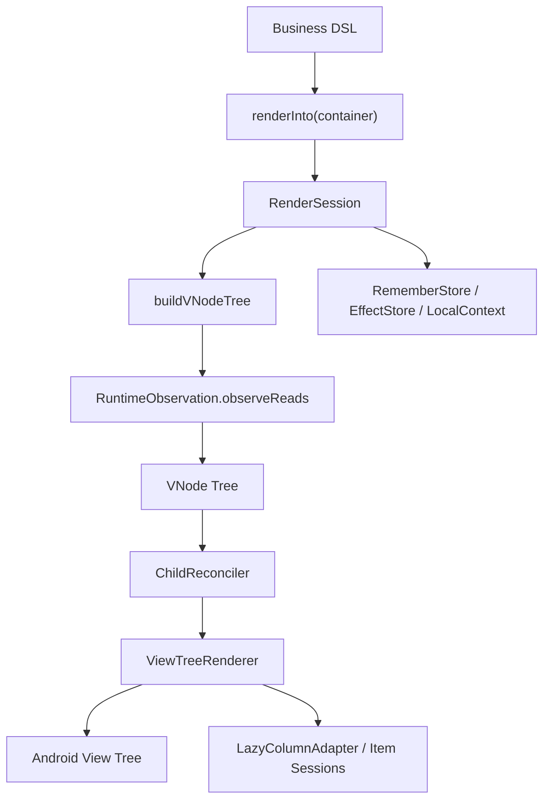
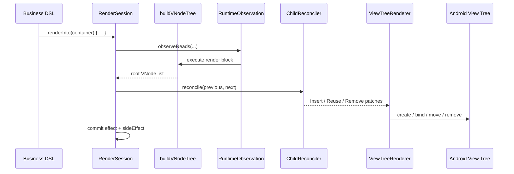
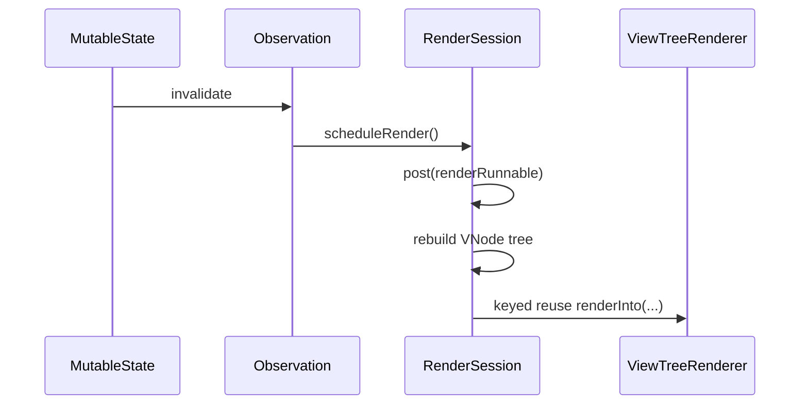
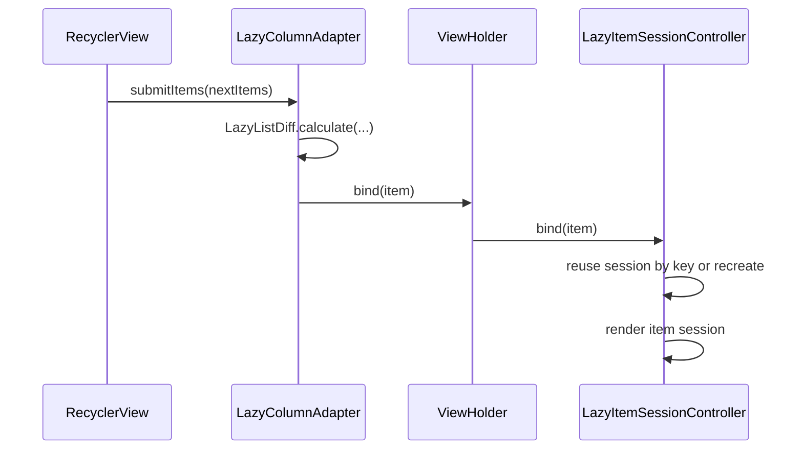

# UIFramework Architecture

## 1. 文档定位

本文档用于重新定义 `UIFramework` 当前阶段的真实架构基线。

它不再描述“最初想做成什么”，而是回答 3 个更重要的问题：

1. 现在这套框架实际上是怎么工作的
2. 当前设计哪些部分是合理的，哪些部分已经偏离最优方向
3. 后续继续开发时，应该以什么架构边界为准，避免再次跑偏

后续如果实现需要偏离本文档，必须先更新本文档，再继续开发。

当前状态：

- 日期：2026-02-28
- 仓库：`/Users/gzq/AndroidStudioProjects/UIFramework`
- 当前模块：`:ui-runtime`、`:ui-renderer`、`:ui-widget-core`、`:app`
- 当前技术基线：Kotlin + Android View System，`minSdk 24`，`compileSdk 36`

## 2. 总结结论

当前框架的总体方向是合理的，但文档和实现长期存在两个明显错位：

1. 早期文档把目标写成了“更细粒度的通用 RenderScope + Adapter Registry + 更多模块分层”
2. 实际实现已经收敛成了“根级 RenderSession + keyed child reconcile + 集中式 ViewTreeRenderer + RecyclerView 承载 LazyColumn”

这不是坏事。相反，这说明项目已经自然演化出一条更务实的 v1 路线。

当前结论应明确为：

> `UIFramework` 当前是一个基于 Android View 的声明式渲染框架 v1，采用根级会话驱动重建、虚拟树 keyed 复用、集中式 renderer、局部列表 item session，以及基于 local 的主题/环境上下文。

这条路线对当前阶段是合理的，原因如下：

- 产品目标本来就是 “Compose-like on View”，不是复刻 Compose Runtime
- 现阶段最重要的是把“声明式 API + keyed 更新 + View 互操作 + 可调试性”做稳
- 过早追求通用 RenderScope 树、Adapter Registry、更多子模块，只会把复杂度前置

但也必须明确：

- 当前框架还没有实现“全树通用局部 scope 更新”
- 当前 renderer 是明显的集中式单体
- 当前 runtime 能力有一部分仍放在 `ui-widget-core`，而不是纯 `ui-runtime`

所以，正确评价不是“架构已经定型”，而是：

> 当前设计是合理的 v1 骨架，但还不是最终形态；后续应基于当前实际实现继续收敛，而不是继续追逐早期那版理想化蓝图。

## 3. 产品定义

`UIFramework` 的目标仍然保持不变：

> 做一个基于 Android View 的声明式渲染引擎，具备虚拟树、keyed diff、状态驱动更新、原生 View 互操作。

但这里的“状态驱动更新”，必须按当前真实能力重新表述：

- 通用页面节点：当前是“根级 render block 重跑 + keyed 复用”
- `LazyColumn` item：当前具备更细的 item session 边界
- 主题 / 环境 / remember / effect：通过 local + store 体系参与一次 render session

也就是说，当前并不是 Compose 那种“任意子树自动细粒度重组”，而是：

> 根级重建 + renderer 最小复用 + 列表项独立 session。

这是一个更准确、更可执行的定义。

## 4. 当前真实模块结构

### 4.1 模块职责

| 模块 | 当前职责 | 评价 |
| --- | --- | --- |
| `:ui-runtime` | `State`、`MutableState`、`derivedStateOf`、读依赖观察 | 合理，但范围偏窄 |
| `:ui-renderer` | `VNode`、`NodeType`、`Modifier`、reconcile、mounted tree、Android View 渲染、自定义容器 | 当前最核心模块 |
| `:ui-widget-core` | DSL、`renderInto`、`RenderSession`、`remember`、effect、local、theme、environment、widget 默认值 | 当前实际上的 composition/runtime 表层 |
| `:app` | demo、主题切换、能力演示、回归验证入口 | 合理 |

### 4.2 模块评价

当前模块拆分虽然不“纯”，但对现阶段是合理的：

- `ui-runtime` 没有被过早做大
- `ui-renderer` 承担了大部分真正有技术含量的底层实现
- `ui-widget-core` 既是 DSL 层，也是 composition/session 层，这在 v1 完全可以接受

当前不建议继续拆出：

- `:ui-node`
- `:ui-view-adapter`
- `:ui-debug`
- `:ui-widget-lazy`

这些拆分都还为时过早。现在继续拆，只会增加跨模块维护成本。

## 5. 当前核心调用链

当前真实调用链如下：

最关键的几个真实节点是：

- `renderInto(...)`
- `RenderSession`
- `buildVNodeTree(...)`
- `RuntimeObservation.observeReads(...)`
- `ChildReconciler.reconcile(...)`
- `ViewTreeRenderer.renderInto(...)`

这条链路已经构成了当前项目的真实主干，后续任何设计讨论都应围绕它展开。

## 6. 当前运行时模型

### 6.1 根级 RenderSession

当前框架不是通用 `RenderScope` 树，而是一个根级 `RenderSession`。

`RenderSession` 当前负责：

- 执行 render block
- 建立一次状态读取观察
- 驱动 `VNode` 构建
- 调用 renderer 完成 reconcile + mount
- 提交 `DisposableEffect` / `SideEffect`
- 持有 `RememberStore`

这意味着当前更新模型的真实语义是：

- 状态变化后，`RenderSession` 重新执行根 render block
- renderer 利用 keyed reuse 尽量复用已有 View
- 真正的“局部性”目前主要来自 renderer 的复用，而不是通用 subtree scope

这个设计对 v1 是合理的，因为：

- 逻辑简单
- 调试成本低
- 与 Android View 的主线程模型兼容
- 现阶段已经足以支持 demo 和一般页面

### 6.2 观察模型

当前状态依赖追踪是基于 `RuntimeObservation` 完成的。

真实机制：

1. `RenderSession.render()` 开始一次观察
2. render 中读取 `state.value`
3. `RuntimeObservation` 记录这次 render 读过哪些 state
4. state 变化时，触发当前 session 的 `scheduleRender()`
5. session 在主线程 `post()` 下一次重渲染

它的本质是：

> 根会话级观察，不是通用 scope 图。

这个设计目前是合理的，但文档必须停止把它描述成“已经具备通用 RenderScope 树”。

### 6.3 local / remember / effect

当前 `remember`、`DisposableEffect`、`SideEffect`、`produceState`、`UiTheme`、`UiThemeOverride`、`Environment` 都已经存在，而且都挂在 `ui-widget-core` 的 session 体系上。

这说明项目实际上已经形成了一个“composition runtime 表层”，只是当前没有单独起模块名。

正确认识应当是：

- `ui-runtime` 目前只负责 observable state
- `ui-widget-core` 负责 composition/session/local/effect/theme 这一层

这并不优雅，但当前是合理的。

后续如果这层继续变复杂，再考虑把它提炼成新的 `ui-composition` 或并入更完整的 `ui-runtime`。

## 7. 当前渲染模型

### 7.1 VNode + keyed reconcile

当前渲染模型仍然是正确的：

- DSL 构造 `VNode`
- `ChildReconciler` 在兄弟节点级别做 keyed 复用
- `ViewTreeRenderer` 按 patch 结果插入、复用、移除节点

这里的关键事实是：

- 当前 reconcile 只有 `Insert`、`Reuse`、`Remove`
- 并没有独立的 `Replace / UpdateProps / UpdateModifier / Move` 抽象类型对外存在
- “Move” 语义隐含在 `ReusePatch.targetIndex` + `moveViewToIndex(...)` 中
- “属性差异更新”不是 patch 级 diff，而是 `bindView(...)` 时全量重绑当前节点

这不是缺陷，而是当前阶段的合理简化。

当前正确表述应为：

> 框架已经具备显式 patch 列表，但 patch 模型仍然是 sibling reuse 导向，而不是细粒度属性 patch 导向。

### 7.2 集中式 ViewTreeRenderer

当前 `ViewTreeRenderer` 是一体化 renderer，内部承担：

- `NodeType -> View` 创建
- 各节点 `bind`
- `Modifier` 应用
- child reconcile
- attach/detach/dispose
- `LazyColumn`、`TabPager`、`SegmentedControl` 等特殊节点桥接

这在架构上不是最终形态，但在当前阶段是合理的。

理由：

- 节点数量还没多到必须做 adapter registry
- 当前最大的价值是统一调试和统一行为约束
- 过早抽 adapter 接口，收益低于复杂度

但这里必须写清楚后续边界：

- 继续增加节点类型是允许的
- 但如果 `ViewTreeRenderer` 持续膨胀，就必须抽出 binder / factory / modifier applier 子组件
- 当前不建议直接上完整 `Adapter Registry`

### 7.3 自定义容器策略

当前框架已经没有完全依赖原生 `LinearLayout / FrameLayout` 语义，而是引入了：

- `DeclarativeLinearLayout`
- `DeclarativeBoxLayout`
- `DeclarativeTabPagerLayout`
- `DeclarativeSegmentedControlLayout`

这个方向是正确的。

它解决了两个问题：

1. Android 原生容器表达力不够
2. 声明式布局语义需要更稳定的父容器控制权

所以，后续设计应明确一条原则：

> 只要原生 `ViewGroup` 不能稳定承载框架语义，就允许引入少量自定义容器；不要被“必须完全复用系统容器”束缚。

## 8. 当前列表模型

`LazyColumn` 是当前设计里最合理的部分之一。

当前真实策略：

- 容器基于 `RecyclerView`
- diff 基于 `LazyListDiff`
- identity 校验基于 `LazyListIdentityInspector`
- item 渲染基于 `LazyItemSessionController`
- item 可拥有独立 session 和本地 `remember`

这条路线非常合理，应当继续坚持。

原因：

- 避免自研滚动与回收系统
- item 状态边界更清晰
- 直接验证 keyed identity 是否可靠
- 更符合 Android View 生态现实

这里要明确冻结一个架构决定：

> `LazyColumn` 继续基于 `RecyclerView`，短期内不做自研 lazy container。

## 9. 当前主题与环境模型

主题系统已经从“样式工具”演变成真实的运行时上下文系统。

当前已经具备：

- `UiTheme`
- `UiThemeOverride`
- `Theme.current`
- `LocalValue / LocalContext`
- `Environment`
- `AndroidThemeBridge`

这说明当前架构里已经存在一个明确子系统：

> 基于 local 的声明式上下文系统。

这部分设计是合理且成熟的，应在总架构中正式承认，而不是把它当成 widget 附属功能。

因此，后续架构讨论必须把以下几类能力视为同一层问题：

- theme
- environment
- remember
- effect
- side effect

它们都属于“composition/session 上下文层”。

## 10. 设计合理性评估

### 10.1 当前明确合理的部分

1. `DSL -> VNode -> View` 三层分离是正确的
2. 根级 `RenderSession` 对当前阶段是合理复杂度
3. keyed sibling reconcile 的实现方式简单、可测、可调试
4. `RecyclerView + item session` 的 `LazyColumn` 策略非常合理
5. local 驱动的主题 / 环境系统已经形成稳定方向
6. 自定义容器补足原生 `ViewGroup` 的表达缺陷，这个决策是正确的

### 10.2 当前不合理或必须纠正的认知

1. 文档不能再声称框架已经具备通用 `RenderScope` 树
2. 文档不能再把 `Adapter Registry` 视为当前实际架构
3. 文档不能再把工程描述成“只有空白 app”
4. 文档不能再用“局部 scope 更新”概括整个框架现状

真实情况是：

- 当前是根级 render + 复用式增量更新
- 列表 item 具备更细粒度 session
- 通用 subtree scope 还没有形成

### 10.3 当前真正的结构问题

当前有 3 个真实问题需要在后续持续约束：

1. `ViewTreeRenderer` 过于集中
   - 当前还能接受
   - 继续膨胀就必须拆解内部职责

2. `ui-widget-core` 同时承担 DSL 和 composition runtime
   - 当前可接受
   - 如果 effect/local/session 继续增长，就要考虑提炼独立层

3. 通用节点更新仍依赖根 render 重跑
   - 当前适合 v1
   - 但如果后面进入更复杂页面，这会成为性能与可预测性的上限

## 11. 更新后的架构基线

从现在开始，项目按下面这套基线理解和继续开发。

### 11.1 固定不变的部分

- 保持 `Android View` 为真实承载层
- 保持 `VNode` 为中间表达层
- 保持 `RenderSession` 为当前根级更新入口
- 保持 `ChildReconciler + ViewTreeRenderer` 为核心更新链
- 保持 `LazyColumn -> RecyclerView` 路线
- 保持 theme / environment / remember / effect 基于 local/session 体系

### 11.2 当前不做的部分

- 不做完整 Router
- 不做编译器插件
- 不做通用 Adapter Registry
- 不做额外模块过度拆分
- 不做自研 lazy scroll container
- 不急着做全树细粒度 subtree scope

### 11.3 后续如果继续演进，优先顺序应该是

1. 继续稳定 composition runtime 表层
   - `remember`
   - effect
   - local
   - theme
   - environment

2. 控制 renderer 膨胀
   - 先拆内部 binder / background / input / container 子职责
   - 不急着抽通用 adapter registry

3. 增强组件和状态语义
   - 输入控件
   - 容器状态
   - 主题 token

4. 最后再评估是否值得做通用 subtree scope

## 12. 实际数据流

### 12.1 首次渲染

### 12.2 状态变化

### 12.3 Lazy item 更新

## 13. 风险与约束

### 13.1 当前主要风险

| 风险 | 说明 | 当前约束 |
| --- | --- | --- |
| 文档比实现更理想化 | 容易误导后续设计 | 以后所有架构文档必须写“当前真实能力” |
| renderer 继续膨胀 | switch 和 bind 逻辑会越来越重 | 新节点进入前先判断是否该拆 renderer 内部职责 |
| runtime 分层继续模糊 | `ui-widget-core` 会越来越重 | composition/session 能力继续增长时再考虑独立层 |
| 错把 keyed reuse 当成通用局部重组 | 容易产生性能误判 | 统一承认当前是根级重跑模型 |

### 13.2 当前协作约定

从现在开始，后续新增能力必须先回答下面 3 个问题：

1. 它属于 state/runtime、composition/session、renderer，还是 widget/theme？
2. 它是否会继续膨胀 `ViewTreeRenderer`？
3. 它是否真的需要新的模块，还是只是当前模块内拆职责即可？

如果没有回答清楚，不应直接实现。

## 14. 下一阶段建议

按当前项目状态，后续最合理的技术方向不是继续改大架构，而是：

1. 稳定现有 composition runtime
   - 继续补 `remember` / effect / local 的边界测试

2. 控制 renderer 复杂度
   - 把 `ViewTreeRenderer` 内部逐步拆成更小的职责块

3. 继续加强组件系统
   - 主题
   - 输入控件
   - 容器语义

4. 暂缓更激进的设计
   - Router
   - 编译器插件
   - 通用 RenderScope 树
   - 过细模块拆分

这条路线最符合当前项目的真实成熟度。

