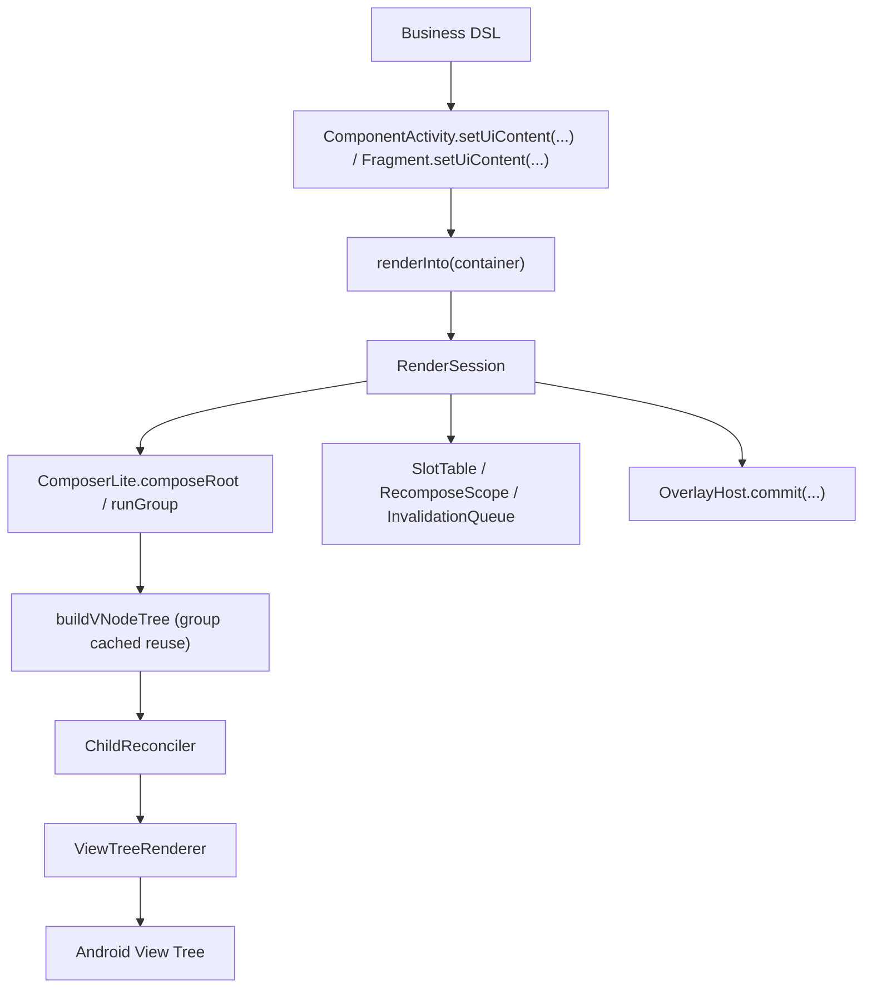

# ViewCompose Architecture

## 1. 文档定位

本文档是 `ViewCompose` 的**当前架构规范版**，用于定义：

1. 模块职责边界
2. 核心调用链
3. 新增代码的落点规则
4. 变更时必须遵守的约束

如果实现要偏离本文档，必须先更新文档，再改代码。

历史长版快照见：

- [ARCHITECTURE_FULL_2026-03-06.md](/Users/gzq/AndroidStudioProjects/UIFramework/docs/archive/ARCHITECTURE_FULL_2026-03-06.md)

## 2. 当前基线（2026-03）

- 技术基线：Kotlin + Android View System
- SDK：`minSdk 24`、`compileSdk 36`
- 当前模块：`:viewcompose-runtime`、`:viewcompose-ui-contract`、`:viewcompose-widget-core`、`:viewcompose-renderer`、`:viewcompose-host-android`、`:viewcompose-overlay-android`、`:viewcompose-image-coil`、`:viewcompose-lifecycle`、`:viewcompose-viewmodel`、`:viewcompose-benchmark`、`:app`

### 2.1 模块职责

| 模块 | 职责 | 约束 |
| --- | --- | --- |
| `viewcompose-runtime` | 状态与读依赖观察（`state/observation`） | 纯 Kotlin/JVM 模块；主源码禁止 `android.*` / `androidx.*`，构建不引入 AndroidX 依赖 |
| `viewcompose-ui-contract` | 纯 Kotlin UI 契约层（`Modifier`、`VNode/NodeSpec`、layout 枚举、collection/state 协议） | 主源码禁止 `android.*` / `androidx.*` |
| `viewcompose-widget-core` | DSL、Theme/Defaults、Local 与 overlay 声明契约 | 不依赖 `viewcompose-renderer`；不放 Android 宿主入口 API |
| `viewcompose-renderer` | Android View 渲染实现（reconcile、binder、patch、container） | 只消费 `ui-contract`，不承载业务 DSL |
| `viewcompose-host-android` | Android 宿主运行时与入口（`setUiContent/renderInto/RenderSession`、`AndroidView/nativeView`、宿主 Local 注入） | 只做平台执行与注入，不承载业务 DSL |
| `viewcompose-overlay-android` | Android overlay host/presenter（Dialog/Popup/ModalBottomSheet/Snackbar/Toast） | 只做平台实现，不依赖 renderer 资源 |
| `viewcompose-image-coil` | 远程图片加载桥接（`RemoteImageLoader` Android 实现） | 通过平台无关 target 契约接入，不回流核心渲染逻辑 |
| `viewcompose-lifecycle` | 生命周期感知的状态收集 API（`collectAsStateWithLifecycle`）与生命周期 Local 对外入口 | 不承载 Android 视图实现；不新增宿主注入逻辑 |
| `viewcompose-viewmodel` | ViewModel/SavedStateHandle 协作 API（`viewModel`、`savedStateHandle`）与 ViewModel Local 对外入口 | 不承载 Android 视图实现；不新增宿主注入逻辑 |
| `viewcompose-benchmark` | 宏基准入口与性能回归数据采集 | 不承载业务 demo 与框架语义逻辑 |
| `app` | demo、manual verification、ui tests 入口 | 不承载框架核心实现 |

### 2.2 当前架构判断

当前架构是可维护的 View-based 声明式 v1：

1. 主树更新模型：`SlotTable Lite` 节点组脏区重组 + 根树引用复用
2. 列表/分页等复用容器：独立 session 刷新路径
3. overlay：声明契约与平台实现已分层
4. 节点语义已完成 `NodeSpec-only` 收口（无 `Props` 双轨）
5. 生命周期与 ViewModel 协作 API 已从 `widget-core` 拆分到独立模块，宿主自动注入能力保持不变

### 2.3 `app` 目录落位基线

`app` 模块采用“入口与演示分层”：

1. `app/src/main/java/com/viewcompose/activity/entry`
   - 根入口 Activity（如 `MainActivity`、渲染宿主入口）
2. `app/src/main/java/com/viewcompose/activity/demo/pages/<domain>`
   - demo 页面 Activity 路由入口，按页面域分层（`core/interaction/advanced/quality`）
3. `app/src/main/java/com/viewcompose/activity/demo/sandbox`
   - 非核心页面实验入口（动画/手势/图形等）
4. `app/src/main/java/com/viewcompose/demo/core`
   - demo 全局骨架与共享能力（catalog、theme session、test tags、section helpers）
5. `app/src/main/java/com/viewcompose/demo/pages/<feature>`
   - 按功能页归档的 demo 实现（foundations/layouts/input/feedback/...）
6. `app/src/androidTest/java/com/viewcompose`
   - demo/UI 回归测试

### 2.4 `viewcompose-renderer` 目录落位基线

renderer 侧避免“单目录平铺”，按职责拆到二级目录：

1. `viewcompose-renderer/src/main/java/.../view/container/{core,layout,collection,navigation,input}`
   - Android View 容器映射层，按控件族群分类
2. `viewcompose-renderer/src/main/java/.../view/tree/binder/core`
   - 绑定流程核心（factory/differ/plan/registry/modifier）
   - `NodeBinderDescriptors` 是 bind/patch/diff 元数据单源注册表（禁止并行映射）
   - `ViewModifierApplier` 仅作 facade，具体职责拆到 `core/modifier` 子模块
3. `viewcompose-renderer/src/main/java/.../view/tree/binder/widget`
   - 分控件 binder 实现（content/input/media/feedback/collection 等）
4. `viewcompose-renderer/src/main/java/.../view/lazy/{adapter,focus,layout,reuse,session,state}`
   - 延迟容器子系统按能力拆分（适配器、焦点跟随、间距布局、复用策略、session、状态）

## 3. 核心调用链

## 4. 强约束边界

### 4.1 平台实现边界

1. Android `Dialog/PopupWindow/Toast/Snackbar` 宿主实现只放 `viewcompose-overlay-android`。
2. `viewcompose-widget-core` 只保留平台无关声明契约与 runtime 组合能力。
3. demo 专用逻辑不回流到框架模块。

### 4.2 `Modifier / NodeSpec / Theme` 边界

1. `Modifier`：通用修饰与 scoped parent-data。
2. 组件语义参数：走组件 DSL 参数 + `NodeSpec`。
3. 主题默认值：走 `Theme -> Defaults`，不把主题直接做成通用 modifier。
4. 禁止新增 `Props/TypedPropKeys/PropKeys/node.props` 动态语义路径。

对应规范：

- [MODIFIER.md](/Users/gzq/AndroidStudioProjects/UIFramework/MODIFIER.md)
- [NODE_PROPS.md](/Users/gzq/AndroidStudioProjects/UIFramework/NODE_PROPS.md)
- [THEMING.md](/Users/gzq/AndroidStudioProjects/UIFramework/THEMING.md)

### 4.3 宿主接入边界

1. `com.viewcompose.host.android.ComponentActivity.setUiContent(...)` 不暴露内部 `RenderSession` 给页面调用方，并由宿主自动管理 `dispose`。
2. `com.viewcompose.host.android.Fragment.setUiContent(...)` 是官方入口：不暴露内部 `RenderSession`，并在 `viewLifecycleOwner` 销毁时自动 `dispose`。
3. `setUiContent` 的默认 `overlayHostFactory` 走 `OverlayHostDefaults.androidOrNoOp(...)`：优先通过 `OverlayHostFactoryProvider`（`ServiceLoader`）发现 Android 实现；缺失时回退 no-op 并输出提示。
4. `overlay-android` 必须通过 `META-INF/services` 注册 `OverlayHostFactoryProvider`，禁止回退字符串反射装配（`Class.forName`）。
5. host 对外回调 `onRenderStats/onRenderResult` 只能暴露 core 自有诊断类型（`com.viewcompose.widget.core.RenderStats/RenderTreeResult`），renderer 诊断类型仅允许出现在 host 内部适配层。
6. system bars insets 走组件侧 `Modifier.systemBarsInsetsPadding(...)`，不绑死 Activity 全局参数。
7. core 渲染引擎由 `viewcompose-host-android` 通过 `installCoreRenderEngine(...)` 接口注册，`widget-core` 不再通过反射装配 renderer。

### 4.4 延迟 session 容器边界

只要容器满足“延迟创建 + holder/session 复用”，就必须视为一级架构对象，必须具备：

1. 结构稳定时的可见内容刷新路径
2. 空 diff 刷新保障
3. recycle/dispose 与生命周期一致性
4. framework 托管的 `RecyclerView/ViewPager2` 容器默认保持“本地池 + 系统动画器”；可通过 `Modifier.lazyContainerReuse(...)` 对单个容器启用共享池和关闭 `itemAnimator`

专项清单：

- [SESSION_CONTAINER_CHECKLIST.md](/Users/gzq/AndroidStudioProjects/UIFramework/SESSION_CONTAINER_CHECKLIST.md)

### 4.5 Environment 边界

1. 宿主入口（`com.viewcompose.host.android.setUiContent(...)`）默认自动注入 `UiEnvironment(androidContext = root.context)`。
2. 业务层允许在局部子树使用 `UiEnvironment(values = ...)` 做覆盖；默认注入不阻断局部覆写。
3. `viewcompose-renderer` 不依赖 `viewcompose-widget-core/context/Environment`，只消费 renderer 已解析的 `NodeSpec` 与平台参数。
4. `viewcompose-renderer` 中的 dp/sp 尺寸换算统一走内部工具（`viewcompose-renderer/view/DimensionUtils.kt`），容器类禁止私有 `density/dpToPx` 重复实现。
5. Android 平台环境提取入口固定为 `AndroidEnvironmentBridge`，新增 Android 环境字段时必须先扩展该桥接，再进入 `UiEnvironmentValues`。

### 4.6 Local 扩展边界

1. 业务侧自定义 token 必须通过统一 Local API：`uiLocalOf`、`UiLocals.current`、`ProvideLocal`、`ProvideLocals`。
2. `viewcompose-widget-core` 内置 Local 也统一走上述 API，不再新增专用 `ProvideXxx` 调用范式。
3. `viewcompose-renderer` 不新增 Local 语义入口；只消费 reconcile 后的 `NodeSpec`。
4. Local 的 snapshot/restore 必须与延迟容器、overlay 场景一致传播，不允许能力回退。
5. 生命周期与 ViewModel 相关 Local 的对外包名固定为 `com.viewcompose.lifecycle` 与 `com.viewcompose.viewmodel`；默认注入由 `viewcompose-host-android` 的 `AndroidHostBridge` 完成。

### 4.7 SlotTable Lite 重组边界

1. `ComposerLite` 是唯一组合内核，`RenderSession` 仅负责“首帧 compose + 后续增量 recompose”的调度，不再走 session 级全树读依赖观察；失效重绘调度固定走 `Choreographer` 帧对齐路径。
2. 组边界由 `UiTreeBuilder.emit(...)` 建立；未脏组直接复用上次 `VNode` 引用，dirty 组才重建。
3. 组级失效来源固定为两类：状态读依赖失效、`emit` 输入（`spec/modifier`）变化；两者都进入 `InvalidationQueue` 去重合并。
4. 结构漂移（同层 group key/顺序不一致）必须回退到最近稳定祖先子树重组，并只打印一次告警，禁止 silent corruption。
5. `LocalContext` 必须按组 snapshot/restore，保证局部重组下 Local 读取一致。

### 4.8 State Snapshot 边界

1. `MutableState` 必须通过 snapshot 事务写入，不允许绕过 `SnapshotRuntime` 直接改值。
2. `mutableStateOf` 的去抖/冲突语义由 `SnapshotMutationPolicy` 定义；默认 `structuralEqualityPolicy`。
3. 并发 `MutableSnapshot.apply()` 冲突处理固定为：先判等、再 merge、merge 失败即失败返回。
4. `ComposerLite` 每轮 compose 必须运行在一致性读快照中，保证同一轮读取不漂移。
5. `DerivedState` 缓存失效必须感知 snapshot 读版本，禁止仅靠全局 dirty 布尔。

### 4.9 Render 调度边界

1. `RenderSession.render()` 保持立即执行语义（首帧与显式调用同步渲染）。
2. 状态失效触发的重绘必须通过 `FrameAlignedRenderDispatcher` 合帧调度，禁止回退到 `container.post`。
3. 同一帧内多次 invalidation 只能触发一次 `RenderSession` 渲染提交。
4. `dispose()` 必须取消未执行帧回调，禁止 session 销毁后延迟渲染。
5. lazy item session 与 overlay surface session 继续复用 `RenderSession.render()` 的立即语义，避免首显空白。

### 4.10 Renderer 绑定复杂度边界

1. `NodeViewBinderRegistry` 与 `NodeBindingDiffer` 的 bind/patch/diff 映射必须从 `NodeBinderDescriptors` 单源派生，禁止新增并行手工 map。
2. 新增 `NodeType` 或新增 `NodeViewPatch` 时，只允许修改 descriptor 源；不得同时改 registry/differ 的独立映射分支。
3. `ViewModifierApplier` 仅负责编排，不承载具体细节实现；样式/交互/insets/容器策略必须分别落在 `core/modifier` 子职责对象。
4. 任何绕过 descriptor 的快速修复都视为架构违规，必须在同一迭代回补为单源注册。

### 4.11 模块单包根边界

1. 每个模块只允许一个包根前缀，且必须与模块职责对应（允许该前缀下的子包分层）。
2. 约束范围覆盖 `src/main`、`src/test`、`src/androidTest`，测试源码不允许例外包根。
3. Android 模块 `namespace` 必须与该模块包根一致（`viewcompose-ui-contract` 作为 Kotlin/JVM 模块例外）。
4. lifecycle/viewmodel 的 Local 对外 API 包名固定为 `com.viewcompose.lifecycle` 与 `com.viewcompose.viewmodel`，并且源码归属必须落在对应模块，不得回流 `widget-core`。

## 5. 当前热点与风险

1. `ViewTreeRenderer` 仍是复杂度热点，新增能力优先拆辅助对象，不继续堆主类。
2. 当前是“节点组级重组 + 根级遍历调度”模型；后续优化重点是提升组键稳定性诊断与更细粒度跳过命中率。
3. `viewcompose-widget-core` 已解除对 `renderer` 的直依赖；后续演进优先维持 `runtime/ui-contract/widget-core/renderer/host-android` 分层，不回流耦合。
4. 延迟 session 容器专项回归已覆盖 `LazyVerticalGrid/HorizontalPager/VerticalPager`；后续重点转向 sticky headers 与复杂 list state 组合场景。
5. `AndroidHostBridge` 已迁至 `viewcompose-host-android`；若后续目标扩展到跨平台，下一步重点是进一步收口 `widget-core` 内 Android 专属 bridge（theme/environment）边界。

## 6. 变更落地清单（必须执行）

任何架构相关改动，至少完成：

1. 模块/目录归属审查
2. 文档同步（本文档 + 相关规范文档）
3. 单元测试或 instrumentation 回归（按能力类型选择）
4. demo 验证路径补齐

执行流程规则见：

- [WORKFLOW.md](/Users/gzq/AndroidStudioProjects/UIFramework/WORKFLOW.md)

## 7. 关联文档

1. 统一能力路线图：[ROADMAP.md](/Users/gzq/AndroidStudioProjects/UIFramework/ROADMAP.md)
2. 性能主线：[PERFORMANCE.md](/Users/gzq/AndroidStudioProjects/UIFramework/PERFORMANCE.md)
3. 状态快照规范：[STATE_SNAPSHOT.md](/Users/gzq/AndroidStudioProjects/UIFramework/STATE_SNAPSHOT.md)
4. 文档入口：[CONTEXT.md](/Users/gzq/AndroidStudioProjects/UIFramework/CONTEXT.md)
