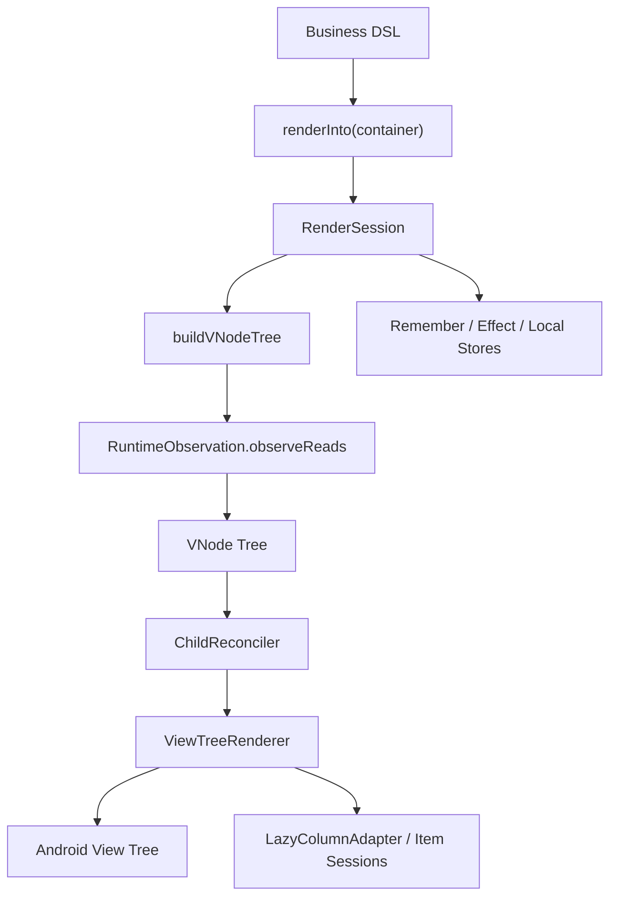

# UIFramework Architecture

## 1. 文档定位

本文档定义 `UIFramework` 当前阶段的真实架构基线，用来回答 4 个问题：

1. 现在框架实际上是怎么工作的
2. `ui-runtime`、`ui-renderer`、`ui-widget-core` 的职责是否清晰
3. 当前架构和 Compose 相比，稳定性、健壮性、可扩展性还缺什么
4. 后续开发应该沿什么方向继续收敛，而不是再回到早期理想化蓝图

如果实现要偏离本文档，必须先更新本文档，再继续开发。

当前状态：

- 日期：2026-03-01
- 仓库：`/Users/gzq/AndroidStudioProjects/UIFramework`
- 当前模块：`:ui-runtime`、`:ui-renderer`、`:ui-widget-core`、`:ui-image-coil`、`:app`
- 技术基线：Kotlin + Android View System，`minSdk 24`，`compileSdk 36`

## 2. 当前总判断

当前框架的方向是成立的，但必须把评价说准确：

> `UIFramework` 现在是一个基于 Android View 的声明式渲染框架 v1，采用根级 `RenderSession` 驱动重建、虚拟树 keyed 复用、集中式 renderer、列表 item session、以及基于 local 的主题/环境上下文。

这条路对当前阶段是合理的，因为：

- 已经能稳定支撑“声明式 API + View 互操作 + keyed 更新 + demo/manual test”
- 复杂度仍然可控
- 和 Android View 主线程模型是兼容的

但它还不是最终形态。和 Compose 相比，当前架构仍然有 4 个明显短板：

1. 更新粒度仍然偏粗，通用页面节点仍以“根级重跑 + keyed 复用”为主
2. renderer 仍然过于集中，`ViewTreeRenderer` 是明显的大类
3. 组合运行时还主要住在 `ui-widget-core`，`ui-runtime` 仍然过薄
4. `VNode + Props` 仍然偏动态，类型约束和错误发现能力弱于 Compose

所以正确结论不是“架构已经成熟”，而是：

> 当前架构是合理的 v1 骨架，但后续必须继续收敛职责、减少隐式约定、增强类型和边界，而不是继续无限堆功能。

## 3. 产品定义

当前产品定义保持不变：

> 做一个基于 Android View 的声明式渲染引擎，具备虚拟树、keyed diff、状态驱动更新、原生 View 互操作。

但这里的“状态驱动更新”必须按当前真实能力表述：

- 普通页面节点：根级 render block 重跑 + renderer keyed reuse
- `LazyColumn` item：具备独立 item session 和本地状态边界
- 主题 / 环境 / remember / effect：基于 local + session store 参与一次 render session

它不是 Compose 那种“任意子树细粒度重组”，而是：

> 根级重建 + 最小复用 + 列表项独立 session。

## 4. 当前真实模块职责

### 4.1 模块级职责

| 模块 | 当前职责 | 当前评价 |
| --- | --- | --- |
| `:ui-runtime` | 可观察状态、派生状态、读依赖观察 | 结构清晰，但范围偏窄 |
| `:ui-renderer` | `VNode`、`Modifier`、patch/reconcile、Android View 挂载、自定义容器、lazy adapter | 当前技术核心，结构比过去清晰 |
| `:ui-widget-core` | DSL、session、remember/effect、local/theme/environment、widget 默认值 | 当前最混，但已整理目录 |
| `:ui-image-coil` | 可选远程图片加载桥接 | 角色清晰，边界合理 |
| `:app` | demo、人工测试、主题切换、回归入口 | 合理 |

### 4.2 当前目录结构

当前目录已经按职责重新整理。

#### `ui-runtime`

```text
runtime/
  observation/
  state/
```

解释：

- `state/` 放 `State`、`MutableStateImpl`、`DerivedStateImpl`
- `observation/` 放 `RuntimeObservation`
- `UiRuntime.kt` 仍在根目录，作为轻量入口

评价：

- 这个结构是清晰的
- 问题不在目录，而在模块范围太小

#### `ui-renderer`

```text
renderer/
  debug/
  layout/
  modifier/
  node/
  reconcile/
  view/
    container/
    lazy/
    tree/
```

解释：

- `layout/` 放布局算法和 parent-data 校验
- `node/` 放 `VNode` 相关模型
- `reconcile/` 放 patch / diff
- `view/container/` 放自定义 View 容器
- `view/lazy/` 放 `LazyColumn` 的 adapter/session/controller
- `view/tree/` 放 mounted tree 和总渲染器

评价：

- 当前目录已经能反映 renderer 内部职责
- 但 `node/` 里仍混着不同层级的概念：`VNode` 本体、媒体 source、input primitive、tab/list item
- `ViewTreeRenderer` 仍然是单点复杂度中心

#### `ui-widget-core`

```text
widget/core/
  bridge/
  context/
  defaults/
  dsl/
  runtime/
```

解释：

- `bridge/` 放 Android theme/environment 桥接
- `context/` 放 local、theme、environment、content color、image loading local
- `defaults/` 放所有 widget 默认值解析
- `dsl/` 放 `UiTreeBuilder`、`LayoutScopes`、`Widgets`、`Dimensions`
- `runtime/` 放 `RenderSession`、`RenderInto`、remember/effect 等 composition 表层

评价：

- 这次整理后，目录层已经基本清楚
- 但模块级职责仍偏重：`ui-widget-core` 现在同时承担 DSL、composition runtime、theme、defaults
- 这是当前最需要在后续继续分层的地方

## 5. 当前核心调用链



当前真实主干是：

- `renderInto(...)`
- `RenderSession`
- `buildVNodeTree(...)`
- `RuntimeObservation.observeReads(...)`
- `ChildReconciler.reconcile(...)`
- `ViewTreeRenderer.renderInto(...)`

后续所有架构讨论都应围绕这条真实主链，而不是围绕早期未落地的抽象。

## 6. 当前合理点

当前架构里，有几件事是正确的，不应该推倒重来。

### 6.1 根级会话模型是合理的

当前 `RenderSession` 是根级 session，不是通用 scope 树。

这在 v1 是合理的，因为：

- 逻辑简单
- 调试成本低
- 能和 Android View 更新模型稳定对接
- 现阶段大多数页面问题都还不是“缺少细粒度重组”，而是“语义和边界没收干净”

### 6.2 keyed reconcile 路线是正确的

当前 renderer 的核心价值不在“超复杂 patch 类型”，而在：

- `VNode`
- keyed sibling reuse
- mount tree 复用
- `LazyColumn` item session

这条路线和 React/Redwood/Litho 的基础思想是一致的，应该保留。

### 6.3 主题 / environment / local 采用 local 机制是正确的

这一点已经很接近 Compose 的成熟经验：

- 全局提供
- 局部覆盖
- widget 默认值按当前上下文解析

这条线应该继续扩展，而不是回退到 Android Theme 直读。

### 6.4 不急着拆更多 Gradle 模块是正确的

现在继续拆出 `ui-node`、`ui-debug`、`ui-theme` 这类模块，收益不大，维护成本更高。

当前问题是“模块内边界”，不是“Gradle 模块数量不够”。

## 7. 当前不合理点

这里是当前真正需要直说的问题。

### 7.1 `ui-widget-core` 仍然承担过多职责

当前 `ui-widget-core` 同时承担：

- DSL
- composition/session runtime
- local/context/theme/environment
- defaults

这在 v1 还可以接受，但再继续堆功能就会恶化成“大一统表层模块”。

这也是当前最不合理的结构点。

结论：

- 现在不必拆新模块
- 但后续如果继续扩 runtime 和导航，必须考虑把 `runtime/` 和 `context/` 从 `ui-widget-core` 中提升出来

### 7.2 `ViewTreeRenderer` 仍然过于集中

当前 `ViewTreeRenderer` 同时负责：

- `NodeType -> View` 创建
- prop 绑定
- modifier 应用
- child patch 执行
- 特殊容器桥接

这在当前阶段还能接受，但再继续长下去会带来三个风险：

- 单类回归面越来越大
- 新节点接入成本越来越高
- 很难引入更细的测试边界

结论：

- 当前不建议上完整 adapter registry
- 但下一阶段如果继续扩控件，应该先把 `create / bind / modifier apply / special host` 分成内部 helper

### 7.3 `VNode + Props` 仍然过于动态

当前 `Props` 本质上仍是 `Map<String, Any?>`。

这会带来：

- prop key 拼写和组合错误只能运行时发现
- 节点类型与 prop 集合之间没有强类型约束
- renderer 的防御性代码被迫增多

和 Compose 相比，这是当前稳定性和健壮性最明显的差距之一。

Compose 的优势在于：

- 参数是强类型
- 编译期就知道哪些组件接受哪些语义
- 默认值、slot、scope 都受类型系统约束

而我们当前更多依赖约定和测试。

结论：

- 当前 `Props` 设计适合 v1 快速演进
- 但如果未来继续做大，必须考虑逐步引入 typed prop model，而不是永远停留在 string key map

### 7.4 通用页面节点更新粒度仍偏粗

当前普通页面节点仍然主要依赖：

- 根级 render 重跑
- renderer keyed reuse

这对一般 demo 和中小页面够用，但和 Compose 相比，差距很明确：

- Compose 可以对子树更细粒度重组
- 我们当前更多靠 renderer 复用来降低损耗

这带来的风险是：

- 大页面重建成本可能上升
- state 爆发频繁时更依赖 renderer 健壮性
- 调试时更难区分“逻辑上局部更新”和“实现上全树重跑但复用成功”

结论：

- 这不是当前最优先要解决的问题
- 但它是长期扩展上限的核心瓶颈

### 7.5 目录虽清晰，但 package 仍然扁平

本次整理优先做的是“按文件夹归类”，没有同步做 package 大迁移。

这是当前合理取舍，因为：

- 先降低回归风险
- 先让代码阅读路径清晰

但这也意味着：

- 模块内的物理结构已经清楚
- 类型命名空间还没有真正体现职责分层

结论：

- 当前先保持 package 稳定
- 未来如果继续演进到更成熟阶段，可以再评估 package 分层

## 8. 和 Compose 的对比

这里不谈语法像不像，只谈结构能力。

### 8.1 当前已经对齐的点

- 声明式 DSL
- 局部 theme / local 覆盖
- `remember` / effect / key scope
- 父布局 scope modifier
- widget 默认值通过 theme 解析
- AndroidView 互操作

### 8.2 当前明显落后的点

- 缺少编译器参与，无法做 Compose 式稳定性推断和细粒度重组
- `Props` 动态映射弱于 Compose 的强类型组件参数
- 更新模型仍偏根级重跑
- 缺少 slot table / composition tree 层级的精细管理
- 缺少官方级调试和性能工具

### 8.3 当前反而有现实优势的点

- 直接运行在 Android View 体系上
- 和现有自定义 View、SDK View 互操作成本低
- 更容易被已有 View 项目渐进接入

结论：

> 这个框架不应该追求“复制 Compose”，而应该追求“在 View 体系里把声明式、主题、复用和互操作做稳”。

## 9. 当前稳定性、健壮性、可扩展性判断

### 9.1 稳定性

当前稳定性中等偏上。

优点：

- 手测 demo 已成为稳定回归入口
- 单测已覆盖 reconcile、theme、remember、effect、lazy diff 等关键路径
- 模块目录已清晰，局部修改的风险比之前低

风险：

- `ViewTreeRenderer` 单点复杂度仍高
- `Props` 动态模型仍容易引入 silent bug

### 9.2 健壮性

当前健壮性中等。

优点：

- 已有 parent-data 校验
- 已有 lazy key warning
- 已有 theme/defaults/override 的规则约束

风险：

- 类型约束仍主要依赖测试，不是编译期保证
- 错误配置更多是运行时暴露，而不是编译期阻断

### 9.3 可扩展性

当前可扩展性中等，但必须按约束演进。

如果后续继续遵守以下原则，可扩展性仍然是好的：

- 新 widget 继续走 `Theme -> Defaults -> Props -> Renderer`
- 不再把 widget 自身语义塞回通用 `Modifier`
- 新容器能力优先进自定义容器，不强依赖系统 `LinearLayout`
- 在 renderer 内部先拆 helper，再考虑更大抽象

如果不遵守，则会很快退化成：

- `ui-widget-core` 继续膨胀
- `ViewTreeRenderer` 持续膨胀
- `Props` map 越来越难维护

## 10. 当前后续方向

基于当前状态，后续架构方向应明确为：

1. 保持当前 Gradle 模块数量，不继续拆大模块
2. 优先在模块内继续收敛职责，而不是引入新抽象
3. 继续控制 `Modifier / Prop / Theme` 边界
4. 如果继续扩 runtime，优先考虑把 `ui-widget-core/runtime` 和 `ui-widget-core/context` 抽象成更明确的 composition 层
5. 如果继续扩 renderer，优先把 `ViewTreeRenderer` 内部拆成 helper，而不是直接上 adapter registry
6. 中长期再评估 typed props 和更细粒度更新模型

## 11. 现在的架构基线

当前应以以下判断作为后续开发基线：

- 当前目录结构已经按职责整理完成
- 当前模块职责基本清楚，但 `ui-widget-core` 仍偏重
- 当前架构适合继续做 v1/v1.5，不适合再做“理想化重构”
- 当前最需要防止的不是“抽象不够多”，而是“边界再次变脏”

一句话总结：

> 当前 `UIFramework` 的架构已经从“能跑”进入“可维护的 v1”，但离 Compose 级成熟度还有明显距离；后续工作重点应是持续收边界、补类型约束、减单点复杂度，而不是盲目加层。
